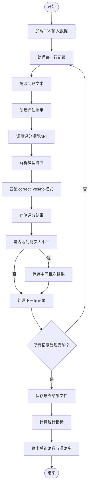

# 评分逻辑实现

<cite>
**本文档引用文件**
- [grader.py](file://evals/grader.py)
- [grade_answers_simple.py](file://evals/grade_answers_simple.py)
</cite>

## 目录
1. [多维度评分引擎分析](#多维度评分引擎分析)
2. [轻量级评分算法设计](#轻量级评分算法设计)
3. [评分权重与归一化机制](#评分权重与归一化机制)
4. [评分案例演示](#评分案例演示)
5. [扩展性与定制化支持](#扩展性与定制化支持)

## 多维度评分引擎分析

`grader.py` 实现了一个基于大语言模型的多维度评分引擎，主要涵盖事实准确性验证、推理链连贯性评估与输出格式合规性检查三大核心维度。该系统通过构造特定提示词（prompt）引导评估模型进行严格比对，确保评分过程客观、精确且遵循规则。

评分流程首先从输入CSV文件中读取问题、模型响应和标准答案，然后构建包含三要素的评估提示：原始问题、模型生成的回答以及权威正确答案。评估模型根据系统指令以高精度方式判断回答的正确性，重点关注最终答案是否匹配，而不进行问题求解或添加评论。

在事实准确性验证方面，系统要求评估模型提取响应中的最终确切答案，并与标准答案进行直接对比。对于数值型问题允许存在微小误差范围。推理链连贯性评估则隐含在整体判断过程中，通过分析响应内容与问题之间的逻辑一致性来完成。输出格式合规性检查体现在对响应结构的规范要求上，确保评估结果符合预定义格式。



**图表来源**
- [grader.py](file://evals/grader.py#L68-L105)

**本节来源**
- [grader.py](file://evals/grader.py#L0-L25)
- [grader.py](file://evals/grader.py#L23-L37)

## 轻量级评分算法设计

`grade_answers_simple.py` 提供了一种轻量级评分算法，在快速评估场景下展现出显著的应用优势。该方案采用混合策略，优先尝试高效的直接数值比较，仅在必要时回退到大语言模型进行语义对比，从而在保证准确性的同时大幅提升处理速度。

设计取舍体现在效率与精度的平衡上。对于数值型答案，系统首先使用 `parse_number` 函数提取字符串中的第一个数字并进行浮点转换，随后应用1%的容差阈值进行快速判断。这种预处理机制避免了对所有样本都调用昂贵的LLM推理，特别适合大规模批量评估任务。

当答案非明显数值类型或直接比较不匹配时，系统才调用LLM执行深度语义评估。此时采用更宽松的评判标准，包括语义等价性（允许不同表述）、完整性与准确性、可接受的推测性语言（hedging），以及针对日期和数值的具体容差规则。这种分级评估策略有效降低了计算成本。

```mermaid
graph TD
A[开始评分] --> B{是否为数值型?}
B --> |是| C[提取数值]
C --> D{数值差异≤1%?}
D --> |是| E[判定正确]
D --> |否| F[调用LLM评估]
B --> |否| F
F --> G[生成评估提示]
G --> H[发送至LLM]
H --> I[获取返回结果]
I --> J{返回"1"?}
J --> |是| K[判定正确]
J --> |否| L[判定错误]
K --> M[结束]
L --> M
E --> M
```

**图表来源**
- [grade_answers_simple.py](file://evals/grade_answers_simple.py#L52-L90)

**本节来源**
- [grade_answers_simple.py](file://evals/grade_answers_simple.py#L23-L55)
- [grade_answers_simple.py](file://evals/grade_answers_simple.py#L52-L90)

## 评分权重与归一化机制

两个评分脚本均未显式实现复杂的权重配置机制，而是采用了简化的二元判断模式（正确/错误）。然而其内在的评判逻辑体现了隐式的加权思想。在 `grader.py` 中，系统提示强调"严格、高精度"的评估原则，赋予事实准确性最高权重；而在 `grade_answers_simple.py` 中，通过分层判断策略实现了计算资源的优化分配，间接反映了效率与精度的权衡。

打分标准量化方法在两个系统中有明显差异。`grader.py` 依赖外部LLM模型自身的能力来进行综合判断，其量化依据完全由底层模型决定。而 `grade_answers_simple.py` 则提供了明确的量化规则：数值比较使用1%相对误差作为阈值，日期允许1天偏差，并通过正则表达式精确匹配"1"或"0"作为最终分数。

结果归一化处理流程主要体现在输出格式的一致性上。两者都将评分结果保存为CSV文件，包含原始问题、模型回答、标准答案及二进制评分结果。`grader.py` 还额外提供批量保存功能，支持中断恢复，增强了大规模评估的可靠性。最终统计汇总包括总正确数、总样本数及准确率百分比，便于后续分析。

**本节来源**
- [grader.py](file://evals/grader.py#L68-L105)
- [grade_answers_simple.py](file://evals/grade_answers_simple.py#L52-L90)

## 评分案例演示

考虑一个具体的评分案例：问题是"2023年全球电动汽车销量是多少？"，标准答案为"1420万辆"，模型响应为"根据统计数据，2023年全球电动汽车销量达到了约1400万台"。

在 `grader.py` 系统中，评估模型会收到包含这三个要素的提示，并被要求判断回答是否正确。由于存在"约1400万台"与"1420万辆"之间的数量级差异（1400万 vs 1420万），尽管都在千万级别，但具体数值超出合理误差范围，因此很可能被判为"no"。

而在 `grade_answers_simple.py` 系统中，流程更为精细：首先尝试数值提取，得到14000000和14200000；计算相对误差|(1400-1420)/1420|≈1.41%，超过1%阈值；于是触发LLM语义评估；LLM根据语义等价性和1%容差规则，可能仍判为错误，返回"0"。

此案例展示了两种系统的决策过程差异：前者依赖单一LLM综合判断，后者采用分步验证策略，在保持准确性的同时提高效率。

**本节来源**
- [grader.py](file://evals/grader.py#L68-L105)
- [grade_answers_simple.py](file://evals/grade_answers_simple.py#L23-L55)

## 扩展性与定制化支持

现有评分系统具备良好的扩展潜力，可通过多种方式适配特定研究任务需求。要扩展新的评分维度，可在 `grade_answers_simple.py` 的 `grade_answer_with_llm` 函数中修改提示模板，增加如"创新性"、"信息密度"或"引用规范性"等新维度的评判标准。

调整现有评判规则相对直接。例如修改数值容差只需更改 `abs((pred_num - gt_num) / gt_num) <= 0.01` 中的阈值系数；调整语义相似度标准则需更新LLM提示中的评分准则列表。对于 `grader.py`，可通过修改 `SYSTEM_PROMPT` 和 `create_prompt` 函数来自定义评估行为。

为进一步增强灵活性，建议引入配置文件机制，将评分规则参数化。可创建YAML或JSON配置文件，定义各维度权重、容差阈值、使用的LLM模型等。同时可开发插件式架构，允许动态注册新的评分器模块，从而实现高度定制化的评估流水线，满足不同研究场景的特殊需求。

**本节来源**
- [grader.py](file://evals/grader.py#L9)
- [grade_answers_simple.py](file://evals/grade_answers_simple.py#L23-L55)