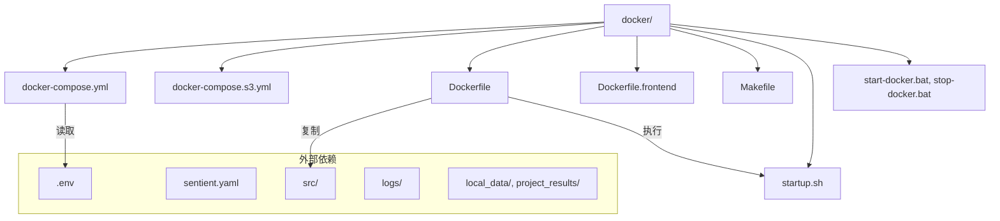
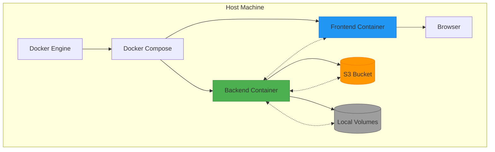
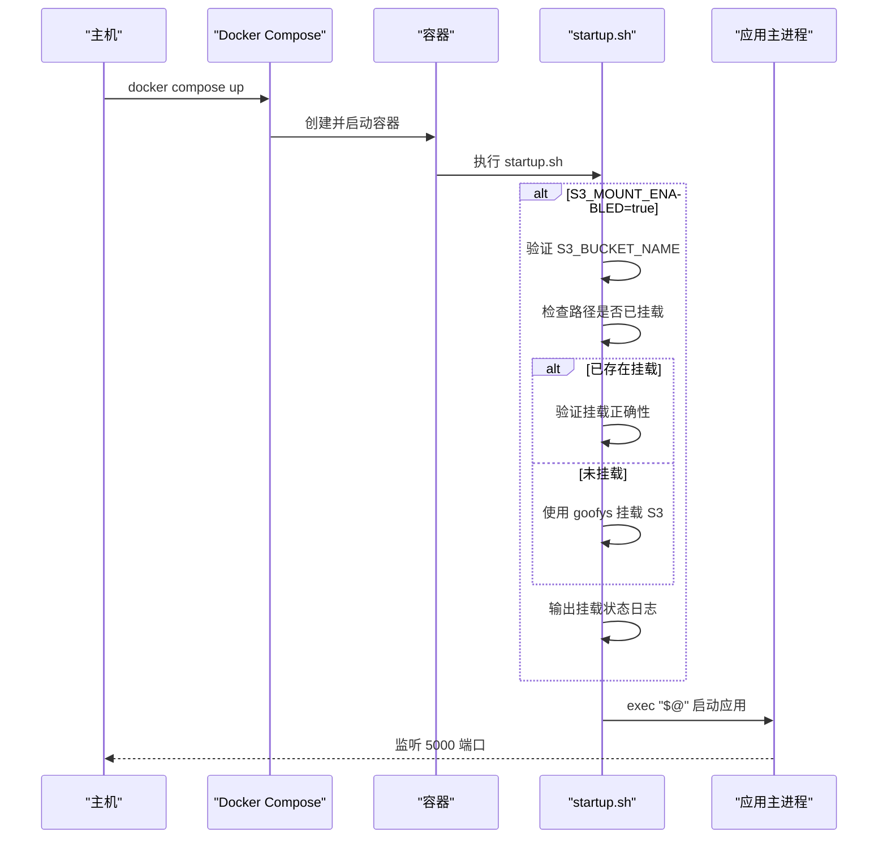
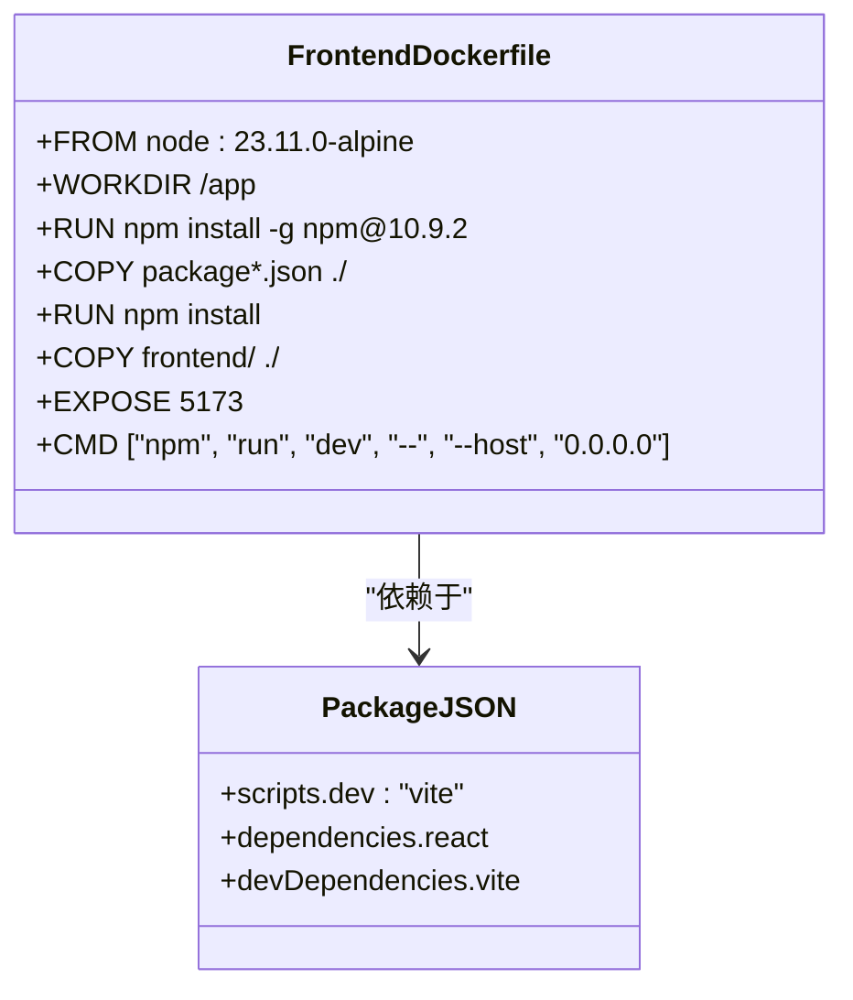
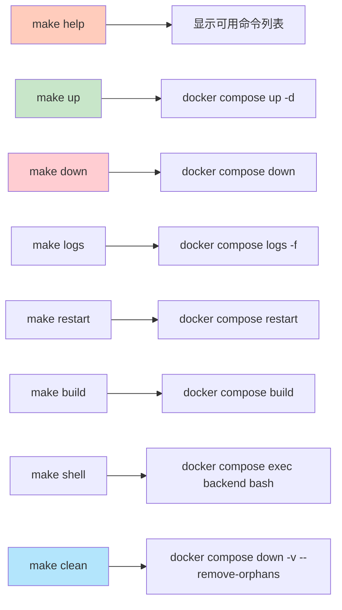

# Docker部署

<cite>
**本文档中引用的文件**  
- [docker-compose.yml](file://docker/docker-compose.yml)
- [Dockerfile](file://docker/Dockerfile)
- [Makefile](file://docker/Makefile)
- [startup.sh](file://docker/startup.sh)
- [docker-compose.s3.yml](file://docker/docker-compose.s3.yml)
- [.env](file://.env)
</cite>

## 目录
1. [简介](#简介)
2. [项目结构](#项目结构)
3. [核心组件](#核心组件)
4. [架构概述](#架构概述)
5. [详细组件分析](#详细组件分析)
6. [依赖分析](#依赖分析)
7. [性能考虑](#性能考虑)
8. [故障排除指南](#故障排除指南)
9. [结论](#结论)

## 简介
本文档详细说明了基于 `docker-compose.yml` 文件的前端与后端服务容器编排配置。涵盖了使用多阶段构建的 `Dockerfile`，包括依赖安装、环境变量设置和启动脚本集成。通过 `Makefile` 提供的一键部署命令（如 build、start、stop）实现快速部署流程。同时介绍了自定义网络、卷映射和端口暴露的最佳实践，并展示了如何利用 `.env` 文件管理敏感信息（如 API 密钥和数据库连接）。最后提供常见问题排查方案，涵盖容器启动失败、依赖缺失或端口冲突等场景。

## 项目结构
项目根目录下的 `docker/` 子目录集中存放所有 Docker 相关资源，形成清晰的容器化部署体系：



**Diagram sources**
- [docker-compose.yml](file://docker/docker-compose.yml#L1-L52)
- [Dockerfile](file://docker/Dockerfile#L1-L56)
- [Makefile](file://docker/Makefile#L1-L38)

**Section sources**
- [docker-compose.yml](file://docker/docker-compose.yml#L1-L52)
- [Dockerfile](file://docker/Dockerfile#L1-L56)
- [Makefile](file://docker/Makefile#L1-L38)

## 核心组件
系统由两个主要服务构成：`backend` 和 `frontend`，分别运行在独立容器中并通过 Docker Compose 统一管理。后端基于 Python FastAPI 框架，前端为 React + TypeScript 构建的现代 Web 应用。两者通过预定义端口通信，且共享统一的环境配置机制。

**Section sources**
- [docker-compose.yml](file://docker/docker-compose.yml#L1-L52)
- [src/sentientresearchagent/server/main.py](file://src/sentientresearchagent/server/main.py#L1-L240)

## 架构概述
整个系统采用标准的前后端分离微服务架构，通过 Docker 容器化封装各组件，确保环境一致性与可移植性。



**Diagram sources**
- [docker-compose.yml](file://docker/docker-compose.yml#L1-L52)
- [Dockerfile](file://docker/Dockerfile#L1-L56)
- [startup.sh](file://docker/startup.sh#L1-L195)

## 详细组件分析

### 后端服务分析
后端服务负责处理业务逻辑、API 请求及与外部数据源交互。其容器配置支持健康检查、环境注入与持久化卷挂载。

#### 多阶段构建过程
```mermaid
flowchart TD
Start([开始构建]) --> BaseImage["FROM ghcr.io/astral-sh/uv:python3.12-bookworm-slim"]
BaseImage --> InstallDeps["RUN apt-get update && install system dependencies"]
InstallDeps --> CopyFiles["COPY pyproject.toml, pdm.lock*"]
CopyFiles --> ConvertLock["RUN pdm export > requirements.txt"]
ConvertLock --> InstallPip["uv pip install -r requirements.txt"]
InstallPip --> CopySrc["COPY src/, sentient.yaml"]
CopySrc --> InstallGoofys["RUN curl -L https://github.com/kahing/goofys/releases/latest/download/goofys"]
InstallGoofys --> CopyStartup["COPY docker/startup.sh /usr/local/bin/"]
CopyStartup --> SetEnv["ENV PYTHONPATH=/app/src"]
SetEnv --> ExposePort["EXPOSE 5000"]
ExposePort --> CMD["CMD [\"/usr/local/bin/startup.sh\", \"uv\", \"run\", \"python\", \"-m\", \"sentientresearchagent\"]"]
style Start fill:#e1f5fe
style CMD fill:#c8e6c9
```

**Diagram sources**
- [Dockerfile](file://docker/Dockerfile#L1-L56)
- [startup.sh](file://docker/startup.sh#L1-L195)

#### 启动流程序列图


**Diagram sources**
- [docker-compose.yml](file://docker/docker-compose.yml#L1-L52)
- [startup.sh](file://docker/startup.sh#L1-L195)

**Section sources**
- [Dockerfile](file://docker/Dockerfile#L1-L56)
- [startup.sh](file://docker/startup.sh#L1-L195)
- [src/sentientresearchagent/server/main.py](file://src/sentientresearchagent/server/main.py#L1-L240)

### 前端服务分析
前端服务提供用户界面，基于 Node.js 运行开发服务器，支持热重载以提升开发效率。

#### 前端Docker构建流程


**Diagram sources**
- [Dockerfile.frontend](file://docker/Dockerfile.frontend#L1-L22)
- [frontend/package.json](file://frontend/package.json#L1-L55)

**Section sources**
- [Dockerfile.frontend](file://docker/Dockerfile.frontend#L1-L22)
- [frontend/package.json](file://frontend/package.json#L1-L55)

### 快捷命令集成分析
`Makefile` 提供了一组简洁的命令别名，简化了常见的 Docker 操作。

#### Makefile命令流程图


**Diagram sources**
- [Makefile](file://docker/Makefile#L1-L38)

**Section sources**
- [Makefile](file://docker/Makefile#L1-L38)

## 依赖分析
系统依赖关系清晰分层，容器间通过命名服务自动发现，无需硬编码 IP 地址。

```mermaid
graph LR
Backend --> Flask[Flask/FastAPI]
Backend --> Uv[UV包管理器]
Backend --> Goofys[goofys for S3]
Backend --> Awscli[AWS CLI工具]
Frontend --> React[React框架]
Frontend --> Vite[Vite构建工具]
Frontend --> SocketIO[Socket.IO客户端]
Backend < --> Frontend
Backend --> S3[(Amazon S3)]
Backend --> LocalVolumes[(本地卷)]
style Backend fill:#4CAF50
style Frontend fill:#2196F3
```

**Diagram sources**
- [Dockerfile](file://docker/Dockerfile#L1-L56)
- [Dockerfile.frontend](file://docker/Dockerfile.frontend#L1-L22)
- [docker-compose.yml](file://docker/docker-compose.yml#L1-L52)

**Section sources**
- [Dockerfile](file://docker/Dockerfile#L1-L56)
- [Dockerfile.frontend](file://docker/Dockerfile.frontend#L1-L22)

## 性能考虑
- **构建速度优化**：使用 `uv` 替代传统 `pip` 实现更快的依赖解析与安装。
- **运行时性能**：通过 `goofys` 实现高性能 S3 文件系统挂载，减少 I/O 延迟。
- **资源隔离**：容器化部署避免环境干扰，保证服务稳定性。
- **缓存策略**：Docker 层级缓存有效加速重复构建过程。

## 故障排除指南
以下列出常见问题及其解决方案：

| 问题现象 | 可能原因 | 解决方案 |
|--------|--------|--------|
| 容器无法启动 | 端口被占用 | 修改 `docker-compose.yml` 中的端口映射 |
| S3挂载失败 | 凭据错误或权限不足 | 检查 `.env` 中 AWS_KEY 和 SECRET 是否正确 |
| 依赖安装失败 | 网络问题或锁文件不一致 | 清理镜像缓存 `docker system prune` 后重建 |
| 健康检查超时 | 应用启动慢于检查周期 | 调整 `healthcheck.start_period` 时间 |
| 日志无输出 | 日志级别设置过高 | 设置 `LOG_LEVEL=DEBUG` 查看详细日志 |
| 前端无法访问后端 | 网络配置错误 | 确保 `VITE_API_URL=http://localhost:5000` 正确 |

**Section sources**
- [docker-compose.yml](file://docker/docker-compose.yml#L1-L52)
- [startup.sh](file://docker/startup.sh#L1-L195)
- [Dockerfile](file://docker/Dockerfile#L1-L56)

## 结论
本项目通过 `docker-compose.yml` 实现了前后端服务的高效容器编排，结合多阶段 `Dockerfile` 构建提升了部署效率。`Makefile` 提供了标准化的操作接口，降低了运维复杂度。S3 挂载机制设计灵活，兼顾安全性与性能。整体架构具备良好的可维护性、可扩展性和跨平台兼容性，适合生产环境部署。