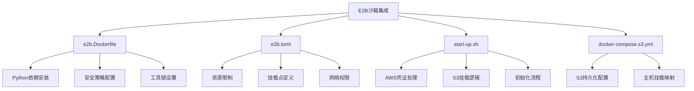
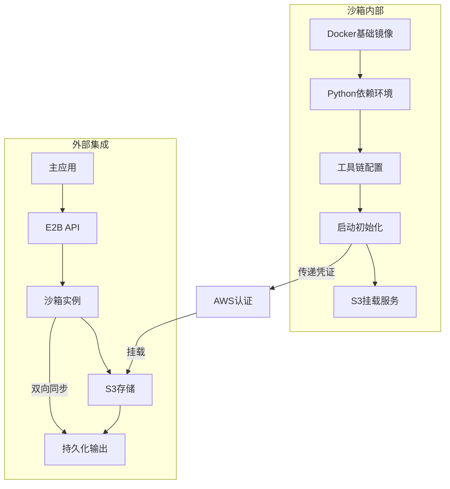
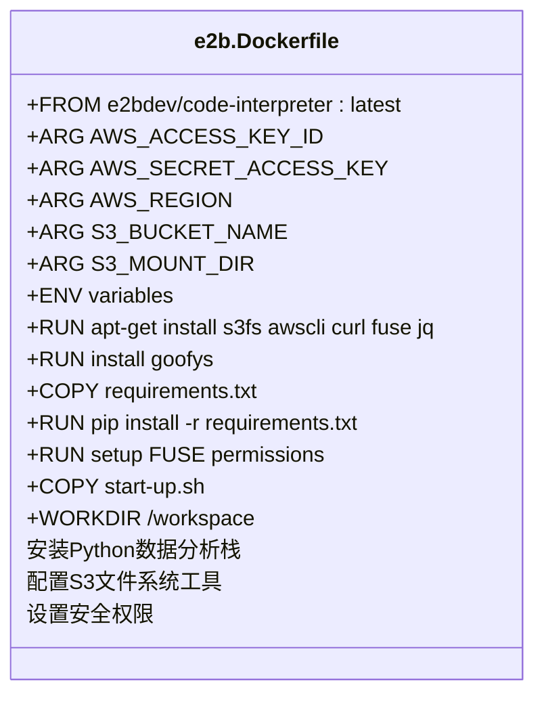
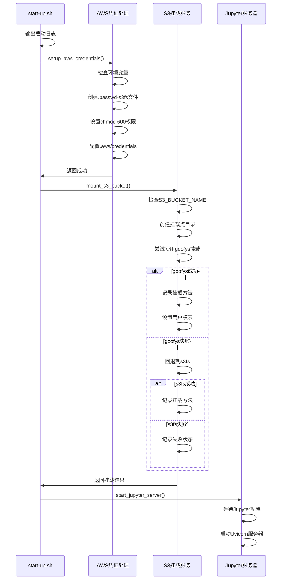
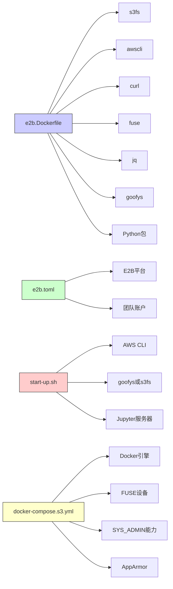

# E2B沙箱集成

<cite>
**本文档引用的文件**
- [e2b.Dockerfile](file://docker/e2b-sandbox/e2b.Dockerfile)
- [e2b.toml](file://docker/e2b-sandbox/e2b.toml)
- [start-up.sh](file://docker/e2b-sandbox/start-up.sh)
- [docker-compose.s3.yml](file://docker/docker-compose.s3.yml)
</cite>

## 目录
1. [项目结构](#项目结构)
2. [核心组件](#核心组件)
3. [架构概述](#架构概述)
4. [详细组件分析](#详细组件分析)
5. [依赖分析](#依赖分析)

## 项目结构

E2B代码执行沙箱的集成主要集中在`docker/e2b-sandbox`目录下，包含定制化运行时环境构建、沙箱行为配置和S3存储集成等关键文件。该沙箱通过Docker容器技术实现安全隔离的代码执行环境，并与主应用系统无缝集成。



**图示来源**
- [e2b.Dockerfile](file://docker/e2b-sandbox/e2b.Dockerfile#L1-L60)
- [e2b.toml](file://docker/e2b-sandbox/e2b.toml#L1-L17)
- [start-up.sh](file://docker/e2b-sandbox/start-up.sh#L1-L195)
- [docker-compose.s3.yml](file://docker/docker-compose.s3.yml#L1-L16)

**本节来源**
- [e2b.Dockerfile](file://docker/e2b-sandbox/e2b.Dockerfile#L1-L60)
- [e2b.toml](file://docker/e2b-sandbox/e2b.toml#L1-L17)
- [start-up.sh](file://docker/e2b-sandbox/start-up.sh#L1-L195)
- [docker-compose.s3.yml](file://docker/docker-compose.s3.yml#L1-L16)

## 核心组件

E2B沙箱集成的核心组件包括：基于Debian的定制化Docker镜像、沙箱行为配置文件、启动初始化脚本以及S3兼容存储的集成配置。这些组件共同构建了一个安全、可扩展且具备持久化能力的代码执行环境。

**本节来源**
- [e2b.Dockerfile](file://docker/e2b-sandbox/e2b.Dockerfile#L1-L60)
- [e2b.toml](file://docker/e2b-sandbox/e2b.toml#L1-L17)
- [start-up.sh](file://docker/e2b-sandbox/start-up.sh#L1-L195)

## 架构概述

E2B沙箱采用分层架构设计，从底层的容器化运行时到上层的应用集成，形成了完整的代码执行解决方案。该架构支持灵活的资源配置、安全的凭证管理以及高效的S3数据同步。



**图示来源**
- [e2b.Dockerfile](file://docker/e2b-sandbox/e2b.Dockerfile#L1-L60)
- [e2b.toml](file://docker/e2b-sandbox/e2b.toml#L1-L17)
- [start-up.sh](file://docker/e2b-sandbox/start-up.sh#L1-L195)
- [docker-compose.s3.yml](file://docker/docker-compose.s3.yml#L1-L16)

## 详细组件分析

### 定制化运行时环境构建

#### Dockerfile配置分析


**图示来源**
- [e2b.Dockerfile](file://docker/e2b-sandbox/e2b.Dockerfile#L1-L60)

**本节来源**
- [e2b.Dockerfile](file://docker/e2b-sandbox/e2b.Dockerfile#L1-L60)

### 沙箱行为参数配置

#### TOML配置分析
```mermaid
flowchart TD
A[e2b.toml] --> B[team_id = \"10c72e9b-7c76-4dce-b9cf-815a783fcf8e\"]
A --> C[start_cmd = \"/root/.jupyter/start-up.sh\"]
A --> D[dockerfile = \"e2b.Dockerfile\"]
A --> E[template_name = \"sentient-e2b-s3\"]
A --> F[template_id = \"5efyoklxeppejs2prlu4\"]
B --> G[团队标识]
C --> H[启动命令]
D --> I[Dockerfile路径]
E --> J[模板名称]
F --> K[模板ID]
style A fill:#f9f,stroke:#333
```

**图示来源**
- [e2b.toml](file://docker/e2b-sandbox/e2b.toml#L1-L17)

**本节来源**
- [e2b.toml](file://docker/e2b-sandbox/e2b.toml#L1-L17)

### S3存储集成配置

#### docker-compose配置分析
```mermaid
erDiagram
docker-compose-s3-yml {
version string
services object
backend object
volumes array
devices array
cap_add array
security_opt array
}
docker-compose-s3-yml ||--o{ volumes : "包含"
docker-compose-s3-yml ||--o{ devices : "包含"
docker-compose-s3-yml ||--o{ cap_add : "包含"
docker-compose-s3-yml ||--o{ security_opt : "包含"
volumes }|--|| backend : "属于"
devices }|--|| backend : "属于"
cap_add }|--|| backend : "属于"
security_opt }|--|| backend : "属于"
class volumes {
- ${S3_MOUNT_DIR:-/opt/sentient}:${S3_MOUNT_DIR:-/opt/sentient}
}
class devices {
- "/dev/fuse:/dev/fuse"
}
class cap_add {
- SYS_ADMIN
}
class security_opt {
- apparmor:unconfined
}
```

**图示来源**
- [docker-compose.s3.yml](file://docker/docker-compose.s3.yml#L1-L16)

**本节来源**
- [docker-compose.s3.yml](file://docker/docker-compose.s3.yml#L1-L16)

### 初始化逻辑与凭证管理

#### 启动脚本流程分析


**图示来源**
- [start-up.sh](file://docker/e2b-sandbox/start-up.sh#L1-L195)

**本节来源**
- [start-up.sh](file://docker/e2b-sandbox/start-up.sh#L1-L195)

## 依赖分析

E2B沙箱集成涉及多个层次的依赖关系，包括工具依赖、配置依赖和运行时依赖。这些依赖确保了沙箱环境的完整性和功能性。



**图示来源**
- [e2b.Dockerfile](file://docker/e2b-sandbox/e2b.Dockerfile#L1-L60)
- [e2b.toml](file://docker/e2b-sandbox/e2b.toml#L1-L17)
- [start-up.sh](file://docker/e2b-sandbox/start-up.sh#L1-L195)
- [docker-compose.s3.yml](file://docker/docker-compose.s3.yml#L1-L16)

**本节来源**
- [e2b.Dockerfile](file://docker/e2b-sandbox/e2b.Dockerfile#L1-L60)
- [e2b.toml](file://docker/e2b-sandbox/e2b.toml#L1-L17)
- [start-up.sh](file://docker/e2b-sandbox/start-up.sh#L1-L195)
- [docker-compose.s3.yml](file://docker/docker-compose.s3.yml#L1-L16)