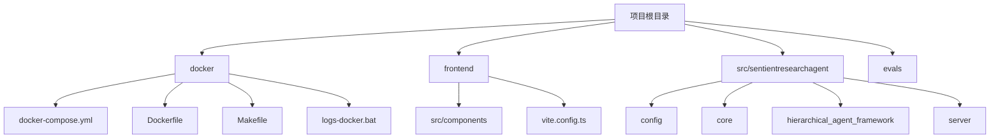
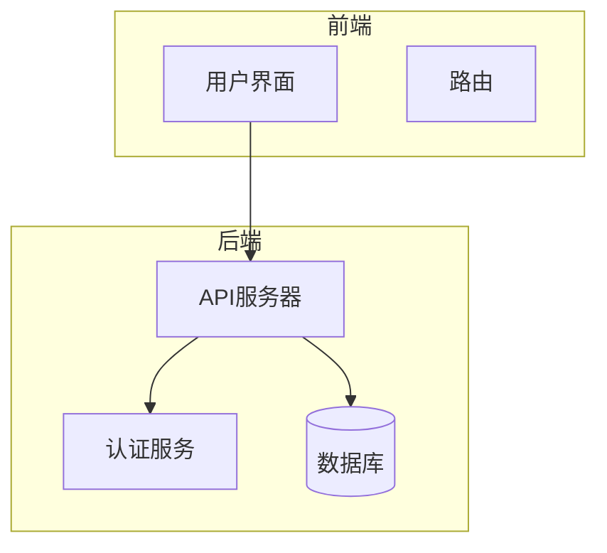
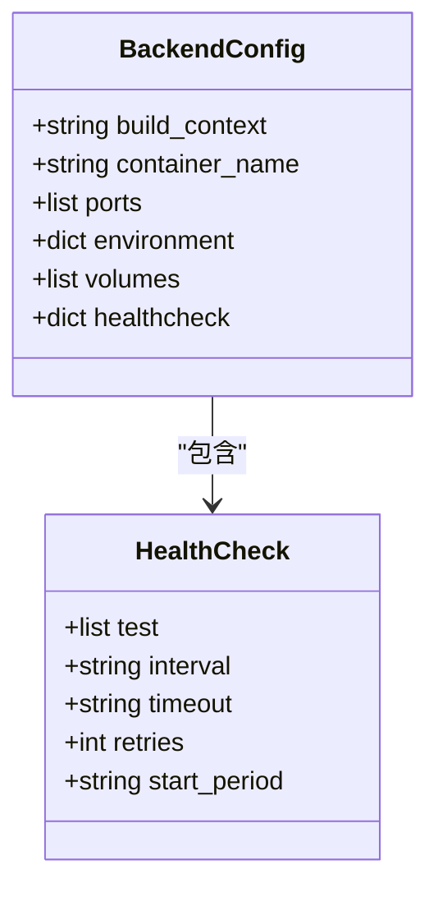
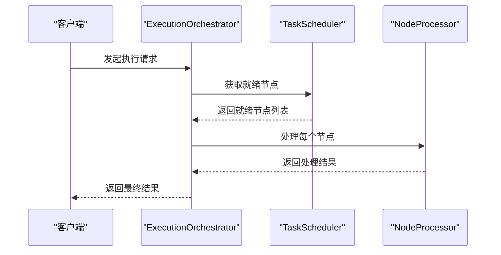
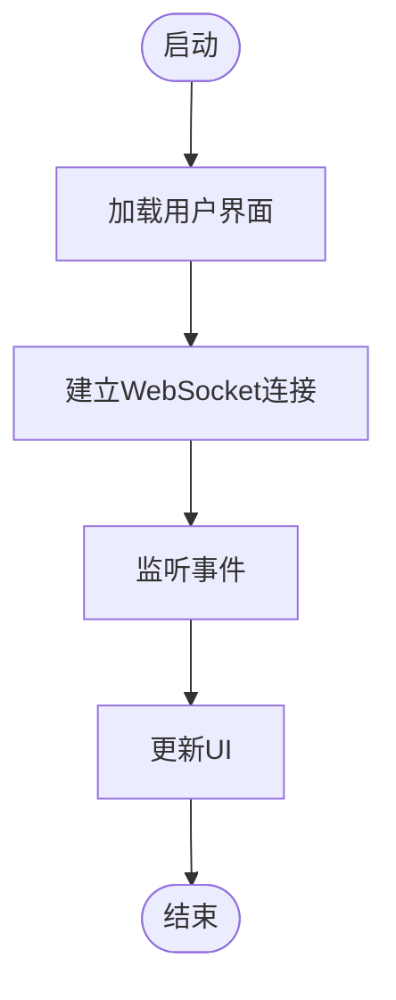
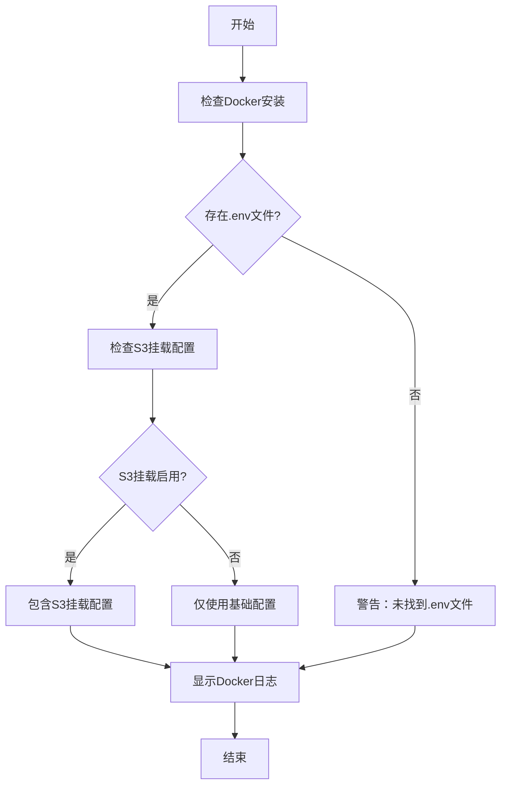
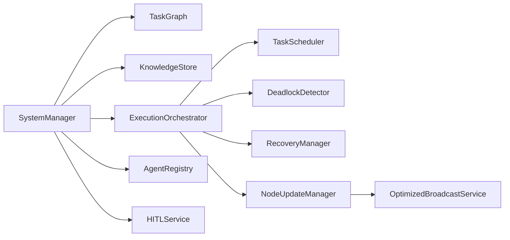

# 生产环境优化

<cite>
**本文档引用的文件**
- [docker-compose.yml](file://docker/docker-compose.yml)
- [Makefile](file://docker/Makefile)
- [logs-docker.bat](file://docker/logs-docker.bat)
- [app.py](file://src/sentientresearchagent/server/app.py)
- [main.py](file://src/sentientresearchagent/server/main.py)
- [config.py](file://src/sentientresearchagent/config/config.py)
</cite>

## 目录
1. [简介](#简介)
2. [项目结构](#项目结构)
3. [核心组件](#核心组件)
4. [架构概述](#架构概述)
5. [详细组件分析](#详细组件分析)
6. [依赖分析](#依赖分析)
7. [性能考虑](#性能考虑)
8. [故障排除指南](#故障排除指南)
9. [结论](#结论)

## 简介
本文档旨在为SentientResearchAgent系统提供生产级部署的性能与稳定性优化建议。基于`docker-compose.yml`中的服务配置，我们将深入分析CPU、内存资源分配策略及健康检查（healthcheck）设置方案。结合`Makefile`中的操作命令，推荐自动化运维流程，包括日志轮转、服务重启与状态监控。利用`logs-docker.bat`分析容器日志输出模式，指导集中式日志收集与错误追踪。同时，我们将探讨如何调整后端服务的并发模型与WebSocket心跳间隔以提升响应能力，并提出关键环境变量的调优参数。

## 项目结构
该项目采用模块化设计，主要分为前端、后端和Docker部署三个部分。前端位于`frontend`目录，使用React框架构建用户界面；后端逻辑在`src/sentientresearchagent`中实现，包含配置管理、核心服务、分层代理框架等；Docker相关文件集中在`docker`目录下，通过`docker-compose.yml`定义多容器应用的服务编排。

**图表来源**
- [docker-compose.yml](file://docker/docker-compose.yml#L1-L52)
- [frontend](file://frontend#L1-L100)
- [src/sentientresearchagent](file://src/sentientresearchagent#L1-L100)

**章节来源**
- [docker-compose.yml](file://docker/docker-compose.yml#L1-L52)
- [project_structure](file://workspace_path#L1-L100)

## 核心组件
系统的核心由多个协同工作的组件构成，主要包括：
- **SystemManager**: 系统的中央协调器，负责初始化和管理所有系统组件。
- **TaskGraph**: 管理任务的层次结构，支持有向无环图（DAG）结构和子图分解。
- **ExecutionOrchestrator**: 高级执行协调器，协调不同服务以执行任务图。
- **NodeProcessor**: 协调单个任务节点的处理，根据节点状态和类型委派给适当的处理器。
- **OptimizedBroadcastService**: 优化的WebSocket广播服务，支持批量发送和差异更新。

这些组件共同构成了系统的骨架，确保了复杂任务的有效分解、执行和状态同步。

**章节来源**
- [system_manager.py](file://src/sentientresearchagent/core/system_manager.py#L87-L486)
- [task_graph.py](file://src/sentientresearchagent/hierarchical_agent_framework/graph/task_graph.py#L1-L20)
- [execution_orchestrator.py](file://src/sentientresearchagent/hierarchical_agent_framework/orchestration/execution_orchestrator.py#L31-L927)
- [node_processor.py](file://src/sentientresearchagent/hierarchical_agent_framework/node/node_processor.py#L68-L254)
- [optimized_broadcast_service.py](file://src/sentientresearchagent/server/services/optimized_broadcast_service.py#L52-L359)

## 架构概述
整个系统采用微服务架构，前后端分离，通过Docker容器化部署。后端服务暴露REST API和WebSocket接口，前端通过Vite构建并托管于独立容器中。系统通过`docker-compose`进行服务编排，实现了开发、测试和生产环境的一致性。

**图表来源**
- [docker-compose.yml](file://docker/docker-compose.yml#L1-L52)
- [app.py](file://src/sentientresearchagent/server/app.py#L1-L125)
- [main.py](file://src/sentientresearchagent/server/main.py#L1-L240)

## 详细组件分析

### 后端服务分析
后端服务是整个系统的核心，负责处理业务逻辑、数据存储和实时通信。其主要功能包括：

#### 服务配置与健康检查
`docker-compose.yml`中定义了后端服务的资源配置和健康检查机制。建议在生产环境中对CPU和内存进行合理分配，以保证服务的稳定运行。

**图表来源**
- [docker-compose.yml](file://docker/docker-compose.yml#L1-L52)

#### 并发模型与执行策略
后端服务采用了先进的并发模型，通过`ExecutionOrchestrator`和`TaskScheduler`来管理任务的执行。`ExecutionConfig`类提供了丰富的配置选项，允许根据实际需求调整并发级别和执行策略。

**图表来源**
- [execution_orchestrator.py](file://src/sentientresearchagent/hierarchical_agent_framework/orchestration/execution_orchestrator.py#L31-L927)
- [task_scheduler.py](file://src/sentientresearchagent/hierarchical_agent_framework/orchestration/task_scheduler.py#L22-L553)
- [node_processor.py](file://src/sentientresearchagent/hierarchical_agent_framework/node/node_processor.py#L68-L254)

### 前端服务分析
前端服务主要负责用户交互和数据展示，通过WebSocket与后端保持实时连接，及时更新任务状态和进度。

**图表来源**
- [websocketService.ts](file://frontend/src/services/websocketService.ts#L1-L50)
- [TaskGraphVisualization.tsx](file://frontend/src/components/graph/TaskGraphVisualization.tsx#L1-L100)

### 自动化运维流程
通过`Makefile`和`logs-docker.bat`脚本，可以实现高效的自动化运维。

#### Makefile操作命令
`Makefile`提供了一系列便捷的命令，用于管理Docker容器的生命周期。

| 命令 | 描述 |
| --- | --- |
| `make up` | 启动所有服务 |
| `make down` | 停止所有服务 |
| `make logs` | 查看日志 |
| `make restart` | 重启服务 |
| `make build` | 重建镜像 |
| `make shell` | 进入后端shell |
| `make clean` | 清理所有资源 |

**章节来源**
- [Makefile](file://docker/Makefile#L1-L38)

#### 日志分析与集中收集
`logs-docker.bat`脚本不仅用于查看日志，还包含了对S3挂载配置的检测逻辑，有助于实现日志的集中管理和持久化存储。

**图表来源**
- [logs-docker.bat](file://docker/logs-docker.bat#L1-L124)

## 依赖分析
系统内部各组件之间存在复杂的依赖关系，正确理解和管理这些依赖对于系统的稳定性和可维护性至关重要。

**图表来源**
- [system_manager.py](file://src/sentientresearchagent/core/system_manager.py#L87-L486)
- [execution_orchestrator.py](file://src/sentientresearchagent/hierarchical_agent_framework/orchestration/execution_orchestrator.py#L31-L927)
- [node_update_manager.py](file://src/sentientresearchagent/hierarchical_agent_framework/services/node_update_manager.py#L31-L305)

## 性能考虑
为了确保系统在高负载下的性能表现，需要从以下几个方面进行优化：

1. **资源分配**：根据`docker-compose.yml`中的配置，合理设置CPU和内存限制，避免资源争用。
2. **并发控制**：利用`ExecutionConfig`中的`max_concurrent_nodes`和`max_parallel_nodes`参数，动态调整并发级别。
3. **缓存机制**：启用`CacheConfig`中的缓存功能，减少重复计算和数据库查询。
4. **日志级别**：在生产环境中将`LOG_LEVEL`设置为`INFO`或更高，减少不必要的日志输出。
5. **健康检查**：定期执行健康检查，及时发现并处理潜在问题。

此外，还可以通过监控工具持续跟踪系统性能指标，如CPU使用率、内存占用、网络延迟等，以便及时做出调整。

## 故障排除指南
当系统出现异常时，可以通过以下步骤进行排查：

1. **检查服务状态**：使用`make logs`命令查看各服务的日志输出，寻找错误信息。
2. **验证配置文件**：确认`.env`文件中的配置项是否正确，特别是S3挂载相关的配置。
3. **测试网络连接**：确保前端能够正常访问后端API和WebSocket接口。
4. **审查代码变更**：如果有最近的代码提交，检查是否有引入新bug的可能性。
5. **联系技术支持**：如果以上方法都无法解决问题，请联系项目维护者寻求帮助。

**章节来源**
- [logs-docker.bat](file://docker/logs-docker.bat#L1-L124)
- [Makefile](file://docker/Makefile#L1-L38)
- [.env](file://../.env#L1-L10)

## 结论
通过对SentientResearchAgent系统的全面分析，我们提出了针对生产环境的性能与稳定性优化建议。这些建议涵盖了从基础设施配置到应用层面调优的各个方面，旨在帮助用户构建一个高效、可靠且易于维护的智能研究代理系统。未来的工作将继续关注新技术的发展趋势，不断改进和完善现有架构，以满足日益增长的业务需求。