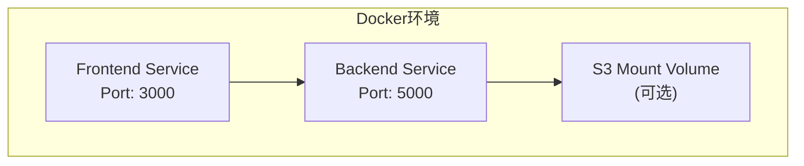
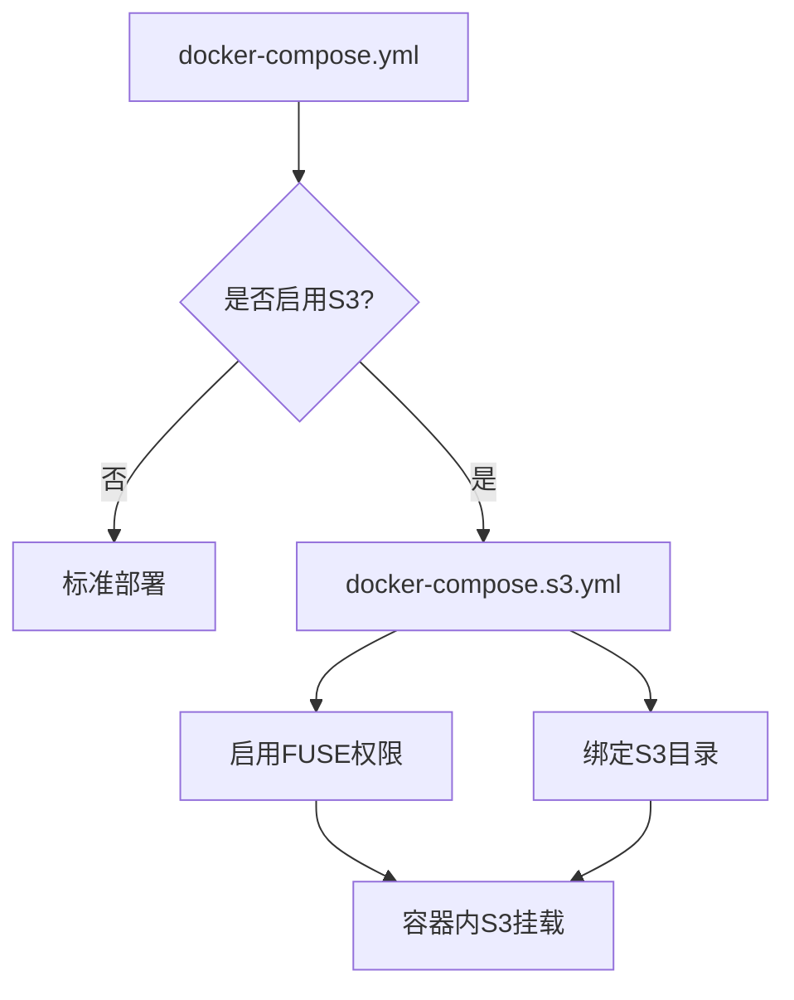
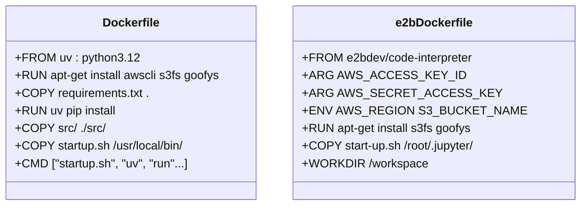
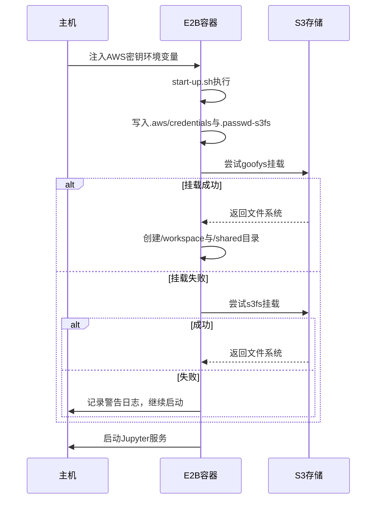

# 部署指南

<cite>
**本文档引用文件**  
- [docker-compose.yml](file://docker/docker-compose.yml)
- [docker-compose.s3.yml](file://docker/docker-compose.s3.yml)
- [Dockerfile](file://docker/Dockerfile)
- [e2b.Dockerfile](file://docker/e2b-sandbox/e2b.Dockerfile)
- [startup.sh](file://docker/startup.sh)
- [start-up.sh](file://docker/e2b-sandbox/start-up.sh)
- [Makefile](file://docker/Makefile)
- [.env.example](file://.env.example)
- [README.md](file://docker/README.md)
</cite>

## 目录
1. [简介](#简介)
2. [项目结构与部署模式](#项目结构与部署模式)
3. [Docker容器化部署](#docker容器化部署)
4. [本地部署方案](#本地部署方案)
5. [多服务编排配置详解](#多服务编排配置详解)
6. [镜像构建说明](#镜像构建说明)
7. [环境变量与安全配置](#环境变量与安全配置)
8. [一键部署命令（Makefile）](#一键部署命令makefile)
9. [E2B沙箱集成与S3同步](#e2b沙箱集成与s3同步)
10. [资源需求与性能建议](#资源需求与性能建议)
11. [健康检查与日志监控](#健康检查与日志监控)
12. [常见问题排查](#常见问题排查)

## 简介
本指南提供SentientResearchAgent系统的生产级部署方案，涵盖Docker容器化与本地两种部署方式。重点说明基于`docker-compose.yml`的多服务编排机制、Docker镜像构建流程、环境变量配置、E2B代码执行沙箱集成以及S3数据持久化同步策略。通过标准化的Makefile实现一键构建、启动和停止服务，确保部署过程稳定可靠。

## 项目结构与部署模式
系统采用前后端分离架构，核心组件包括：
- **前端**：React应用，运行于Vite开发服务器
- **后端**：Python FastAPI服务，支持LLM代理调度与任务编排
- **可选组件**：E2B代码执行沙箱，用于安全执行生成代码
- **数据存储**：支持本地目录或S3对象存储进行结果持久化

部署支持两种模式：
1. **Docker容器化部署**：推荐生产环境使用，保证环境一致性
2. **本地原生部署**：适用于开发调试，依赖系统Python环境

**Section sources**
- [docker-compose.yml](file://docker/docker-compose.yml#L1-L52)
- [README.md](file://docker/README.md#L1-L104)

## Docker容器化部署
使用Docker Compose实现多容器协同部署，主配置文件为`docker-compose.yml`，定义了backend和frontend两个核心服务。

### 后端服务（backend）
- 基于`Dockerfile`构建，使用`uv`加速Python依赖安装
- 映射宿主机5000端口
- 挂载源码目录（只读）、配置文件及持久化数据卷
- 支持`.env`环境变量注入
- 配置健康检查接口 `/api/health`

### 前端服务（frontend）
- 使用独立Dockerfile构建前端镜像
- 映射宿主机3000端口
- 注入API代理地址 `VITE_API_URL=http://localhost:5000`
- 依赖后端服务启动完成



**Diagram sources**
- [docker-compose.yml](file://docker/docker-compose.yml#L1-L52)

**Section sources**
- [docker-compose.yml](file://docker/docker-compose.yml#L1-L52)
- [Dockerfile](file://docker/Dockerfile#L1-L56)

## 本地部署方案
通过`setup.sh`脚本自动配置本地Ubuntu/Debian环境，主要步骤如下：

1. 安装PDM作为包管理器，并启用`uv`后端提升安装速度
2. 创建虚拟环境并安装Python依赖
3. 安装Node.js及npm用于前端构建
4. 执行`pdm install -d`安装开发依赖
5. 使用`make run`或`make frontend-dev`分别启动后端和前端服务

对于Windows用户，提供`setup_native_windows.bat`批处理脚本进行环境初始化。

**Section sources**
- [Makefile](file://Makefile#L1-L165)
- [setup.sh](file://setup.sh)

## 多服务编排配置详解
主编排文件`docker-compose.yml`与S3扩展文件`docker-compose.s3.yml`共同构成完整部署配置。

### 主编排文件功能
- 定义backend和frontend服务
- 设置容器名称、端口映射、环境变量
- 挂载必要数据卷（logs, project_results等）
- 配置健康检查策略

### S3挂载扩展配置
当启用S3持久化时，需加载`docker-compose.s3.yml`覆盖配置：
- 添加S3目录绑定挂载 `${S3_MOUNT_DIR}:/opt/sentient`
- 授予FUSE设备权限 `/dev/fuse`
- 添加`SYS_ADMIN`能力与`apparmor:unconfined`安全选项

该设计允许在不修改主配置的情况下灵活启用S3功能。



**Diagram sources**
- [docker-compose.yml](file://docker/docker-compose.yml#L1-L52)
- [docker-compose.s3.yml](file://docker/docker-compose.s3.yml#L1-L16)

**Section sources**
- [docker-compose.yml](file://docker/docker-compose.yml#L1-L52)
- [docker-compose.s3.yml](file://docker/docker-compose.s3.yml#L1-L16)
- [README.md](file://docker/README.md#L1-L104)

## 镜像构建说明
系统包含两个Docker镜像构建文件：主应用镜像`Dockerfile`与E2B沙箱定制镜像`e2b.Dockerfile`。

### 主应用镜像（Dockerfile）
- 基础镜像：`ghcr.io/astral-sh/uv:python3.12-bookworm-slim`
- 安装系统依赖：awscli, s3fs, goofys, fuse等
- 使用`uv pip install`快速安装Python依赖
- 复制源码、配置文件与启动脚本
- 设置`PYTHONPATH`与`FLASK_APP`环境变量
- 入口命令：`/usr/local/bin/startup.sh`

### E2B沙箱镜像（e2b.Dockerfile）
- 基础镜像：`e2bdev/code-interpreter:latest`
- 接收AWS凭证作为构建参数（ARG）
- 安装s3fs与goofys实现S3挂载
- 配置FUSE权限 `user_allow_other`
- 复制自定义启动脚本`start-up.sh`
- 工作目录设为`/workspace`



**Diagram sources**
- [Dockerfile](file://docker/Dockerfile#L1-L56)
- [e2b.Dockerfile](file://docker/e2b-sandbox/e2b.Dockerfile#L1-L60)

**Section sources**
- [Dockerfile](file://docker/Dockerfile#L1-L56)
- [e2b.Dockerfile](file://docker/e2b-sandbox/e2b.Dockerfile#L1-L60)

## 环境变量与安全配置
所有敏感配置通过`.env`文件集中管理，禁止硬编码于代码中。

### 核心API密钥
- `OPENROUTER_API_KEY`: 主要LLM模型访问密钥
- `EXA_API_KEY`: Web搜索工具密钥
- `GOOGLE_GENAI_API_KEY`: Gemini模型支持
- `ANTHROPIC_API_KEY`: Claude模型支持

### S3存储配置
- `S3_MOUNT_ENABLED=true`: 启用S3挂载
- `S3_BUCKET_NAME=your-bucket-name`: S3桶名
- `S3_MOUNT_DIR=/opt/sentient`: 统一挂载路径
- `AWS_ACCESS_KEY_ID` 和 `AWS_SECRET_ACCESS_KEY`: 凭证信息
- `AWS_REGION`: 区域设置（如us-east-1）

### E2B沙箱配置
- `E2B_API_KEY`: 沙箱平台认证密钥
- `E2B_TEMPLATE_ID=sentient-e2b-s3`: 自定义模板ID
- `E2B_TIMEOUT=300`: 单次执行超时时间（秒）

**重要安全实践**：
- `.env`文件不应提交至版本控制
- 使用`.env.example`作为模板分发
- 在CI/CD环境中通过秘密管理服务注入凭证

**Section sources**
- [.env.example](file://.env.example#L1-L68)
- [README.md](file://docker/README.md#L1-L104)

## 一键部署命令（Makefile）
通过`docker/Makefile`提供简洁的CLI操作接口：

| 命令 | 功能 |
|------|------|
| `make setup` | 运行Docker环境初始化脚本 |
| `make up` | 启动所有服务（后台运行） |
| `make down` | 停止并移除容器 |
| `make logs` | 查看实时日志流 |
| `make restart` | 重启服务 |
| `make build` | 重建镜像 |
| `make shell` | 进入后端容器bash |
| `make clean` | 清理所有容器与卷 |

此外，根目录`Makefile`也提供了`docker-up`、`docker-down`等代理命令，便于统一调用。

**Section sources**
- [Makefile](file://docker/Makefile#L1-L38)
- [Makefile](file://Makefile#L1-L165)

## E2B沙箱集成与S3同步
系统通过E2B平台实现安全的代码执行沙箱，支持与S3无缝集成。

### 安全传递AWS凭证
- 在构建`e2b.Dockerfile`时通过`ARG`接收密钥
- 构建时不保留明文密钥，仅在运行时通过环境变量注入
- 启动脚本`start-up.sh`动态写入`.passwd-s3fs`与`.aws/credentials`

### S3数据同步机制
1. 沙箱启动时检测`S3_BUCKET_NAME`与凭证
2. 使用`goofys`优先尝试高性能挂载
3. 失败时降级使用`s3fs`
4. 挂载点设为`/opt/sentient`，与主应用一致
5. 创建`/opt/sentient/shared`作为共享工作区

### 验证与容错
- 写入测试文件验证挂载有效性
- 多种方法检测挂载状态（mountpoint, ls, AWS CLI）
- 日志记录详细挂载过程便于排查



**Diagram sources**
- [e2b.Dockerfile](file://docker/e2b-sandbox/e2b.Dockerfile#L1-L60)
- [start-up.sh](file://docker/e2b-sandbox/start-up.sh#L1-L195)

**Section sources**
- [e2b.Dockerfile](file://docker/e2b-sandbox/e2b.Dockerfile#L1-L60)
- [start-up.sh](file://docker/e2b-sandbox/start-up.sh#L1-L195)
- [.env.example](file://.env.example#L1-L68)

## 资源需求与性能建议
### 最低资源配置
- CPU：2核
- 内存：4GB
- 存储：20GB可用空间（含缓存与日志）

### 推荐生产配置
- CPU：4核及以上
- 内存：8GB及以上
- 存储：SSD硬盘，50GB以上
- 网络：稳定高速互联网连接（尤其涉及LLM API调用）

### 性能优化建议
- 使用`goofys`而非`s3fs`以获得更高I/O吞吐
- 配置合理的缓存TTL（如`--stat-cache-ttl=10s`）
- 对频繁访问的数据启用本地缓存（`.agent_cache`）
- 监控S3请求费用与速率限制

**Section sources**
- [startup.sh](file://docker/startup.sh#L1-L195)
- [start-up.sh](file://docker/e2b-sandbox/start-up.sh#L1-L195)

## 健康检查与日志监控
### 健康检查配置
后端服务配置了标准化的健康检查探针：
```yaml
healthcheck:
  test: ["CMD", "curl", "-f", "http://localhost:5000/api/health"]
  interval: 30s
  timeout: 10s
  retries: 3
  start_period: 40s
```
该配置确保容器在应用完全就绪后才被标记为健康。

### 日志收集最佳实践
- 所有日志输出至`/app/logs`目录（挂载到宿主机）
- 支持多种日志级别：TRACE, DEBUG, INFO, ERROR等
- 使用`docker compose logs -f`实时查看日志流
- 可结合ELK或Fluentd等工具进行集中式日志分析

### 监控建议
- 监控容器CPU与内存使用率
- 跟踪S3 API调用频率与错误率
- 设置日志关键字告警（如"ERROR", "failed"）
- 定期清理过期日志与缓存文件

**Section sources**
- [docker-compose.yml](file://docker/docker-compose.yml#L1-L52)
- [startup.sh](file://docker/startup.sh#L1-L195)

## 常见问题排查
### 后端无法启动
- 检查日志：`make logs` 或 `docker compose logs backend`
- 验证API密钥是否正确配置
- 确认5000端口未被占用
- 检查Python依赖是否安装成功

### 前端无法加载
- 确保后端服务已健康运行
- 检查3000端口占用情况
- 查看浏览器控制台错误信息

### S3挂载失败
- 确认`S3_MOUNT_ENABLED=true`且凭证有效
- 检查IAM权限是否包含`s3:GetObject`, `s3:PutObject`等
- macOS用户需将`/opt`添加到Docker Desktop文件共享列表
- 查看`startup.sh`中的详细挂载日志

### E2B沙箱连接超时
- 检查`E2B_API_KEY`有效性
- 确认网络可访问E2B服务
- 调整`E2B_TIMEOUT`值

**Section sources**
- [README.md](file://docker/README.md#L1-L104)
- [startup.sh](file://docker/startup.sh#L1-L195)