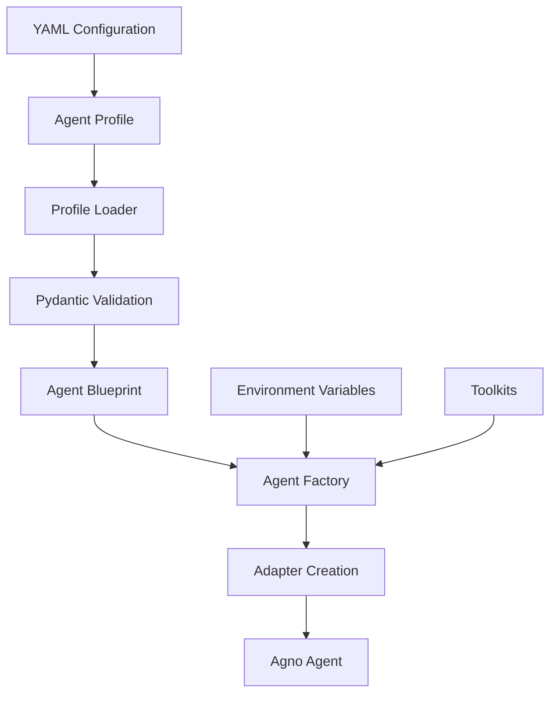
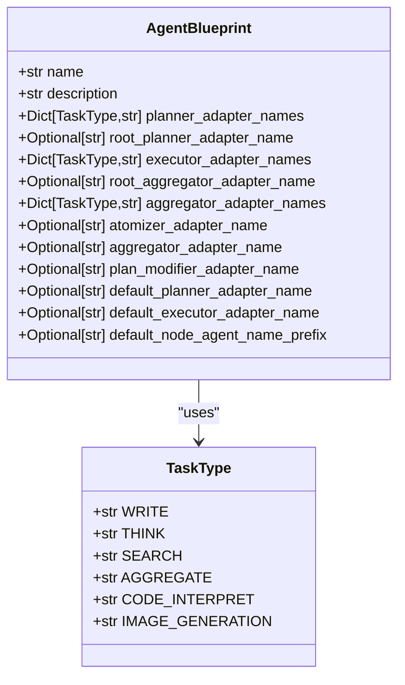
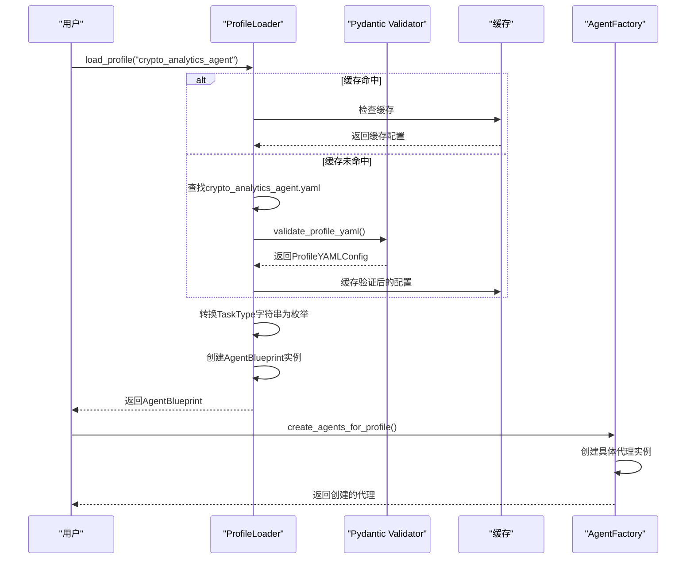

# 代理配置文件

<cite>
**本文档引用的文件**
- [general_agent.yaml](file://src/sentientresearchagent/hierarchical_agent_framework/agent_configs/profiles/general_agent.yaml)
- [crypto_analytics_agent.yaml](file://src/sentientresearchagent/hierarchical_agent_framework/agent_configs/profiles/crypto_analytics_agent.yaml)
- [deep_research_agent.yaml](file://src/sentientresearchagent/hierarchical_agent_framework/agent_configs/profiles/deep_research_agent.yaml)
- [opensourcegeneralagent.yaml](file://src/sentientresearchagent/hierarchical_agent_framework/agent_configs/profiles/opensourcegeneralagent.yaml)
- [profile_loader.py](file://src/sentientresearchagent/hierarchical_agent_framework/agent_configs/profile_loader.py)
- [agent_factory.py](file://src/sentientresearchagent/hierarchical_agent_framework/agent_configs/agent_factory.py)
- [agent_blueprints.py](file://src/sentientresearchagent/hierarchical_agent_framework/agent_blueprints.py)
- [models.py](file://src/sentientresearchagent/hierarchical_agent_framework/agent_configs/models.py)
- [types.py](file://src/sentientresearchagent/hierarchical_agent_framework/types.py)
</cite>

## 目录
1. [引言](#引言)
2. [配置体系架构](#配置体系架构)
3. [核心配置字段解析](#核心配置字段解析)
4. [专业领域代理配置差异](#专业领域代理配置差异)
5. [自定义Agent Profile](#自定义agent-profile)
6. [配置加载与继承机制](#配置加载与继承机制)
7. [配置验证与错误修复](#配置验证与错误修复)
8. [结论](#结论)

## 引言
本系统采用基于YAML的代理Profile配置体系，通过`general_agent.yaml`等配置文件定义不同专业领域的智能代理行为。该体系支持灵活的任务类型映射、根节点特殊处理和默认回退机制，为复杂研究场景提供可扩展的配置解决方案。

## 配置体系架构



**图示来源**
- [profile_loader.py](file://src/sentientresearchagent/hierarchical_agent_framework/agent_configs/profile_loader.py#L1-L220)
- [agent_factory.py](file://src/sentientresearchagent/hierarchical_agent_framework/agent_configs/agent_factory.py#L1-L1008)

**章节来源**
- [profile_loader.py](file://src/sentientresearchagent/hierarchical_agent_framework/agent_configs/profile_loader.py#L1-L220)
- [agent_factory.py](file://src/sentientresearchagent/hierarchical_agent_framework/agent_configs/agent_factory.py#L1-L1008)

## 核心配置字段解析

### profile字段
包含代理的核心配置信息：

**name**: 代理名称标识符，用于唯一识别不同类型的代理。
- 示例：`"DataAnalysisAgent"`、`"crypto_analytics_agent"`

**description**: 代理功能描述，说明其主要用途和特点。

**root_planner_adapter_name**: 根节点专用规划器，用于初始任务分解。
- 约束：必须是注册的PlannerAdapter名称
- 示例：`"CryptoAnalyticsPlanner"`

**root_aggregator_adapter_name**: 根节点专用聚合器，用于最终结果合成。
- 约束：必须是注册的AggregatorAdapter名称

**planner_adapter_names**: 按任务类型映射的规划器适配器。
- 支持的任务类型：WRITE、THINK、SEARCH
- 示例：
```yaml
planner_adapter_names:
  SEARCH: "CryptoSearchPlanner"
  WRITE: "CryptoAnalyticsPlanner"
```

**executor_adapter_names**: 按任务类型映射的执行器适配器。
- 示例：
```yaml
executor_adapter_names:
  SEARCH: "OpenAICustomSearcher"
  THINK: "CryptoMarketAnalyzer"
```

**aggregator_adapter_names**: 按任务类型映射的聚合器适配器。
- 示例：
```yaml
aggregator_adapter_names:
  SEARCH: "CryptoAnalyticsAggregator"
  THINK: "CryptoAnalyticsAggregator"
```

**atomizer_adapter_name**: 原子化处理器名称，默认为"default_atomizer"。

**aggregator_adapter_name**: 回退聚合器名称，用于向后兼容。

**plan_modifier_adapter_name**: 计划修改器名称，默认为"PlanModifier"。

**default_planner_adapter_name**: 默认规划器名称，当特定任务类型无对应规划器时使用。

**default_executor_adapter_name**: 默认执行器名称。

**default_node_agent_name_prefix**: 节点代理名称前缀。

### metadata字段
包含代理的元数据信息：

**version**: 配置版本号，遵循语义化版本规范。

**use_case**: 使用场景描述，说明代理的主要应用场景。

**recommended_for**: 推荐使用场景列表。

**capabilities**: 代理能力列表（特定于crypto_analytics_agent）。

**data_sources**: 数据源列表（特定于crypto_analytics_agent）。

**章节来源**
- [general_agent.yaml](file://src/sentientresearchagent/hierarchical_agent_framework/agent_configs/profiles/general_agent.yaml#L1-L47)
- [crypto_analytics_agent.yaml](file://src/sentientresearchagent/hierarchical_agent_framework/agent_configs/profiles/crypto_analytics_agent.yaml#L1-L71)
- [models.py](file://src/sentientresearchagent/hierarchical_agent_framework/agent_configs/models.py#L738-L796)

## 专业领域代理配置差异

### Data Analysis Agent (general_agent.yaml)
专注于数据分析和可视化任务：
- **核心特点**：通用数据处理能力
- **规划器**：使用增强型搜索、写作和思考规划器
- **执行器**：基础推理执行器配合OpenAI自定义搜索
- **适用场景**：统计分析、商业智能、市场研究

### Crypto Analytics Agent (crypto_analytics_agent.yaml)
专为加密货币和DeFi分析设计：
- **核心特点**：实时区块链数据分析
- **规划器**：专门优化的加密搜索和分析规划器
- **执行器**：`CryptoMarketAnalyzer`进行市场分析，`CryptoResearchExecutor`生成研究报告
- **聚合器**：统一使用`CryptoAnalyticsAggregator`处理各类输出
- **数据源**：集成CoinGecko、DefiLlama、Etherscan等多平台数据
- **能力**：代币深度分析、DeFi协议评估、链上指标追踪

### Deep Research Agent (deep_research_agent.yaml)
面向综合性研究任务：
- **核心特点**：多步骤深度分析
- **规划器**：增强型搜索规划器具有日期感知能力
- **执行器**：基础推理执行器配合OpenAI自定义搜索
- **适用场景**：学术研究、技术调查、事实核查

### Open Source General Agent (opensourcegeneralagent.yaml)
开源版本的通用代理：
- **核心特点**：与general_agent功能相同但专为开源使用设计
- **命名前缀**：`default_node_agent_name_prefix: "OpenSourceGeneral"`
- **适用场景**：开源项目的数据分析需求



**图示来源**
- [agent_blueprints.py](file://src/sentientresearchagent/hierarchical_agent_framework/agent_blueprints.py#L11-L42)
- [types.py](file://src/sentientresearchagent/hierarchical_agent_framework/types.py#L35-L45)

**章节来源**
- [general_agent.yaml](file://src/sentientresearchagent/hierarchical_agent_framework/agent_configs/profiles/general_agent.yaml#L1-L47)
- [crypto_analytics_agent.yaml](file://src/sentientresearchagent/hierarchical_agent_framework/agent_configs/profiles/crypto_analytics_agent.yaml#L1-L71)
- [deep_research_agent.yaml](file://src/sentientresearchagent/hierarchical_agent_framework/agent_configs/profiles/deep_research_agent.yaml#L1-L52)
- [opensourcegeneralagent.yaml](file://src/sentientresearchagent/hierarchical_agent_framework/agent_configs/profiles/opensourcegeneralagent.yaml#L1-L46)

## 自定义Agent Profile

创建新的Agent Profile需遵循以下步骤：

1. **确定业务需求**：明确新代理的专业领域和核心功能。

2. **选择基础模板**：从现有配置文件中选择最接近的作为起点。

3. **定义任务映射**：根据需求配置`planner_adapter_names`、`executor_adapter_names`等字段。

4. **设置根节点处理器**：如有需要，指定`root_planner_adapter_name`和`root_aggregator_adapter_name`。

5. **配置默认值**：设置合理的`default_planner_adapter_name`和`default_executor_adapter_name`。

6. **完善元数据**：在`metadata`部分添加详细的版本、用途和推荐场景信息。

示例：创建金融分析代理
```yaml
profile:
  name: "FinancialAnalyticsAgent"
  description: "Financial market analysis and investment research agent"
  
  root_planner_adapter_name: "FinancialResearchPlanner"
  root_aggregator_adapter_name: "FinancialReportAggregator"

  planner_adapter_names:
    SEARCH: "FinancialDataPlanner"
    WRITE: "InvestmentReportPlanner"
    THINK: "RiskAssessmentPlanner"

  executor_adapter_names:
    SEARCH: "OpenAICustomSearcher"
    THINK: "FinancialModelingExecutor"
    WRITE: "InvestmentReportWriter"

  aggregator_adapter_names:
    SEARCH: "FinancialDataAggregator"
    THINK: "RiskAnalysisAggregator"
    WRITE: "ReportCompositionAggregator"

  default_planner_adapter_name: "FinancialResearchPlanner"
  default_executor_adapter_name: "BasicReasoningExecutor"
  default_node_agent_name_prefix: "FinancialAnalytics"

metadata:
  version: "1.0.0"
  use_case: "Financial market analysis and investment decision support"
  recommended_for:
    - "Stock market analysis"
    - "Investment portfolio evaluation"
    - "Economic indicator tracking"
    - "Risk assessment and management"
```

**章节来源**
- [agent_blueprints.py](file://src/sentientresearchagent/hierarchical_agent_framework/agent_blueprints.py#L11-L42)
- [models.py](file://src/sentientresearchagent/hierarchical_agent_framework/agent_configs/models.py#L738-L796)

## 配置加载与继承机制

### 配置加载流程


**图示来源**
- [profile_loader.py](file://src/sentientresearchagent/hierarchical_agent_framework/agent_configs/profile_loader.py#L58-L156)
- [agent_factory.py](file://src/sentientresearchagent/hierarchical_agent_framework/agent_configs/agent_factory.py#L69-L992)

**章节来源**
- [profile_loader.py](file://src/sentientresearchagent/hierarchical_agent_framework/agent_configs/profile_loader.py#L1-L220)
- [agent_factory.py](file://src/sentientresearchagent/hierarchical_agent_framework/agent_configs/agent_factory.py#L1-L1008)

### 继承与覆盖机制
系统通过层级优先级实现配置继承：

1. **最高优先级**：根节点专用处理器（`root_*`字段）
2. **第二优先级**：任务类型特定处理器（`*_adapter_names`按任务类型映射）
3. **第三优先级**：默认处理器（`default_*`字段）
4. **最低优先级**：系统全局默认值

这种设计允许：
- 根节点采用特殊策略进行初始分解和最终整合
- 不同任务类型使用最适合的处理器
- 提供合理的默认值确保系统健壮性
- 向后兼容旧版配置

## 配置验证与错误修复

### 验证方法
1. **语法检查**：确保YAML格式正确，缩进一致。
2. **必填字段**：确认`name`、`profile`等关键字段存在。
3. **枚举验证**：检查`task_type`是否为有效值（WRITE、THINK、SEARCH等）。
4. **引用验证**：确保所有引用的处理器名称在系统中已注册。

### 常见语法错误及修复
| 错误类型 | 示例 | 修复方法 |
|---------|------|--------|
| 缩进错误 | 错误的空格使用 | 统一使用2个空格进行缩进 |
| 任务类型拼写错误 | `Serch`而非`SEARCH` | 更正为大写的有效任务类型 |
| 必填字段缺失 | 缺少`name`字段 | 添加正确的名称标识符 |
| 引用不存在的处理器 | 使用未注册的适配器名称 | 确保处理器已在系统中定义和注册 |
| 数据类型错误 | 字符串与数字混淆 | 检查并修正数据类型 |

### 验证工具
系统内置了完整的验证机制：
- 使用Pydantic模型进行结构化验证
- 在`validate_profile_yaml`函数中执行全面检查
- 提供详细的错误信息帮助定位问题
- 通过日志记录验证过程和结果

**章节来源**
- [models.py](file://src/sentientresearchagent/hierarchical_agent_framework/agent_configs/models.py#L738-L827)
- [profile_loader.py](file://src/sentientresearchagent/hierarchical_agent_framework/agent_configs/profile_loader.py#L58-L156)

## 结论
本系统的代理Profile配置体系提供了灵活而强大的配置管理能力。通过分层的处理器映射机制，既支持针对不同专业领域的精细化配置，又保持了系统的整体一致性。配置继承机制确保了系统的健壮性和可扩展性，而完善的验证体系则保障了配置的正确性。用户可以根据具体的研究需求，轻松创建和定制适合特定场景的Agent Profile。