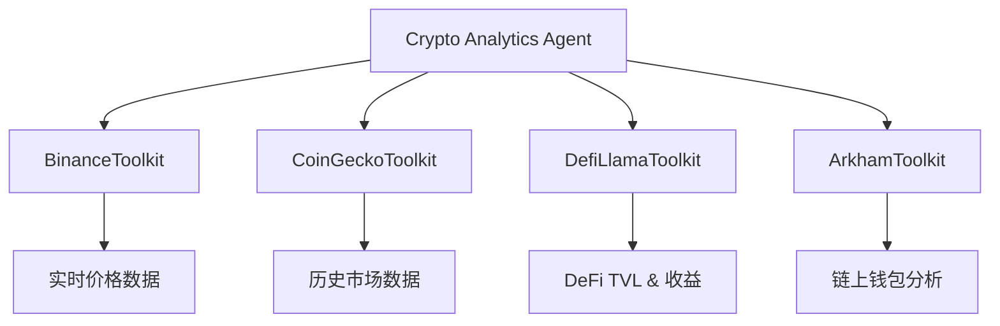

# 代理配置文件具体示例

<cite>
**本文档中引用的文件**  
- [crypto_analytics_agent.yaml](file://src/sentientresearchagent/hierarchical_agent_framework/agent_configs/profiles/crypto_analytics_agent.yaml)
- [deep_research_agent.yaml](file://src/sentientresearchagent/hierarchical_agent_framework/agent_configs/profiles/deep_research_agent.yaml)
- [opensourcegeneralagent.yaml](file://src/sentientresearchagent/hierarchical_agent_framework/agent_configs/profiles/opensourcegeneralagent.yaml)
- [planner_prompts.py](file://src/sentientresearchagent/hierarchical_agent_framework/agent_configs/prompts/planner_prompts.py)
- [executor_prompts.py](file://src/sentientresearchagent/hierarchical_agent_framework/agent_configs/prompts/executor_prompts.py)
</cite>

## 目录
1. [引言](#引言)
2. [核心代理配置对比分析](#核心代理配置对比分析)
3. [工具集允许范围（allowed_tools）差异](#工具集允许范围allowed_tools差异)
4. [提示词模板（prompt_templates）设计差异](#提示词模板prompt_templates设计差异)
5. [模型偏好（model_preferences）与执行行为](#模型偏好model_preferences与执行行为)
6. [任务分解策略与工具调用流程](#任务分解策略与工具调用流程)
7. [新领域专用代理创建指南](#新领域专用代理创建指南)
8. [验证方法与最佳实践](#验证方法与最佳实践)
9. [结论](#结论)

## 引言

本文件旨在深入分析 `crypto_analytics_agent`、`deep_research_agent` 和 `opensourcegeneralagent` 三种专业代理的配置文件，揭示其在业务场景、功能特性及底层设计上的关键差异。通过对比它们在工具集允许范围、提示词模板和模型偏好等方面的定制化设计，阐明每种代理所适配的研究任务类型及其背后的设计考量。此外，本文将结合实际执行流程，说明不同配置如何影响任务分解策略与工具调用行为，并提供基于现有示例创建新领域专用代理的操作指南与验证方法。

**Section sources**
- [crypto_analytics_agent.yaml](file://src/sentientresearchagent/hierarchical_agent_framework/agent_configs/profiles/crypto_analytics_agent.yaml#L1-L70)
- [deep_research_agent.yaml](file://src/sentientresearchagent/hierarchical_agent_framework/agent_configs/profiles/deep_research_agent.yaml#L1-L51)
- [opensourcegeneralagent.yaml](file://src/sentientresearchagent/hierarchical_agent_framework/agent_configs/profiles/opensourcegeneralagent.yaml#L1-L45)

## 核心代理配置对比分析

### crypto_analytics_agent 配置解析

`crypto_analytics_agent` 是一个专为加密货币和去中心化金融（DeFi）分析而设计的高级代理。其配置文件定义了针对区块链数据分析、市场情报收集和代币经济学评估的完整工作流。

该代理的核心特点是采用了高度专业化的规划器（Planner）、执行器（Executor）和聚合器（Aggregator）。例如，其根级规划器 `CryptoAnalyticsPlanner` 被专门优化用于处理复杂的加密市场研究目标。执行器方面，`CryptoMarketAnalyzer` 和 `CryptoResearchExecutor` 能够利用特定的数据工具包（如 BinanceToolkit, CoinGeckoToolkit）进行实时价格分析、链上指标解读和协议TVL评估。

**Section sources**
- [crypto_analytics_agent.yaml](file://src/sentientresearchagent/hierarchical_agent_framework/agent_configs/profiles/crypto_analytics_agent.yaml#L1-L70)

### deep_research_agent 配置解析

`deep_research_agent` 是一个通用型深度研究代理，适用于学术研究、市场调查和技术分析等复杂任务。其设计强调稳健性和可扩展性，使用经过增强的搜索规划器（`EnhancedSearchPlanner`）来确保信息检索的全面性。

此代理采用模块化设计，其组件（如 `BasicReasoningExecutor` 和 `BasicReportWriter`）可以灵活组合以适应不同的研究需求。它特别适合需要多步骤分析、事实核查和综合报告生成的任务。与加密分析代理相比，它的工具集更侧重于通用网络搜索和基础推理能力。

**Section sources**
- [deep_research_agent.yaml](file://src/sentientresearchagent/hierarchical_agent_framework/agent_configs/profiles/deep_research_agent.yaml#L1-L51)

### opensourcegeneralagent 配置解析

`opensourcegeneralagent` 是 `general_agent` 的开源版本，专注于数据可视化、统计研究和商业智能。其配置与 `deep_research_agent` 高度相似，但在元数据描述中明确指出了其适用场景为“定量分析和数据驱动的洞察”。

该代理同样使用 `EnhancedSearchPlanner` 进行任务分解，并依赖 `OpenAICustomSearcher` 获取外部信息。其执行层由 `BasicReasoningExecutor` 和 `BasicReportWriter` 组成，能够有效地处理结构化数据并生成清晰的报告。这种设计使其成为处理公开数据集、市场调研和性能分析的理想选择。

**Section sources**
- [opensourcegeneralagent.yaml](file://src/sentientresearchagent/hierarchical_agent_framework/agent_configs/profiles/opensourcegeneralagent.yaml#L1-L45)

## 工具集允许范围（allowed_tools）差异

### crypto_analytics_agent 的专用工具集

`crypto_analytics_agent` 的配置虽然未直接列出 `allowed_tools` 字段，但其执行器（如 `CryptoMarketAnalyzer`）的提示词模板明确指定了可用的专用工具包：
- **BinanceToolkit**: 提供实时币安现货市场价格、订单簿和K线数据。
- **CoinGeckoToolkit**: 提供全面的加密货币价格、市值和历史图表数据。
- **DefiLlamaToolkit**: 提供完整的DeFi生态系统分析，包括协议总锁仓价值（TVL）和收益机会。
- **ArkhamToolkit**: 提供高级区块链分析、链上情报和钱包活动追踪。

这些工具的集成使得该代理能够在不依赖通用网络搜索的情况下，获取最准确、最新的加密市场数据。



**Diagram sources**
- [crypto_analytics_agent.yaml](file://src/sentientresearchagent/hierarchical_agent_framework/agent_configs/profiles/crypto_analytics_agent.yaml#L1-L70)
- [executor_prompts.py](file://src/sentientresearchagent/hierarchical_agent_framework/agent_configs/prompts/executor_prompts.py#L393-L393)

### deep_research_agent 与 opensourcegeneralagent 的通用工具集

相比之下，`deep_research_agent` 和 `opensourcegeneralagent` 主要依赖于更通用的工具：
- **OpenAICustomSearcher**: 使用AI驱动的网络搜索工具从公开网页获取信息。
- **WikipediaTools**: 访问维基百科的知识库以获取背景信息和历史上下文。

这种设计使它们能够处理广泛的主题，但对特定领域（如加密货币）的深度和实时性不如专用代理。它们的优势在于灵活性和对非结构化知识的访问能力。

**Section sources**
- [deep_research_agent.yaml](file://src/sentientresearchagent/hierarchical_agent_framework/agent_configs/profiles/deep_research_agent.yaml#L1-L51)
- [opensourcegeneralagent.yaml](file://src/sentientresearchagent/hierarchical_agent_framework/agent_configs/profiles/opensourcegeneralagent.yaml#L1-L45)

## 提示词模板（prompt_templates）设计差异

### 角色定位与系统消息

三种代理的提示词模板通过不同的系统消息（System Message）来定义其角色和行为准则，这是其功能差异的核心体现。

#### crypto_analytics_agent 的专业化提示

`CRYPTO_ANALYTICS_PLANNER_SYSTEM_MESSAGE` 将代理定位为“具有区块链分析、DeFi生态系统和加密市场动态深厚专业知识的专家”。这确保了任务分解时会优先考虑加密领域的关键指标，如技术分析、链上数据和代币经济。

`CRYPTO_MARKET_ANALYZER_SYSTEM_MESSAGE` 则要求代理具备“技术分析、链上指标和DeFi分析的专业知识”，并强制要求使用专用数据工具包（如 BinanceToolkit）而非通用搜索，以保证数据的准确性和时效性。

#### deep_research_agent 的通用化提示

`DEEP_RESEARCH_PLANNER_SYSTEM_MESSAGE_TEMPLATE` 将代理定义为“主研究规划师”，擅长将复杂的研究目标分解为全面且结构良好的研究计划。其重点在于战略性的任务拆分，而不是特定领域的知识。

`ENHANCED_SEARCH_PLANNER_SYSTEM_MESSAGE` 特别强调“创建2到4个完全独立的搜索子任务”，以实现并行执行，最大化信息收集效率。这体现了其设计哲学：通过广度和并行性来覆盖复杂问题。

#### opensourcegeneralagent 的数据导向提示

`GENERAL_TASK_SOLVER_SYSTEM_MESSAGE` 定义了一个“精通所有领域”的“通用任务解决者”，其核心竞争力是“战略分解和任务规划”。对于 `BASIC_REPORT_WRITER_SYSTEM_MESSAGE`，则强调“将复杂、多源信息转化为连贯、权威的研究叙事”，同时必须“保留关键数据点”，这突显了其在数据整合和报告生成方面的优势。

**Section sources**
- [planner_prompts.py](file://src/sentientresearchagent/hierarchical_agent_framework/agent_configs/prompts/planner_prompts.py#L3350-L3350)
- [planner_prompts.py](file://src/sentientresearchagent/hierarchical_agent_framework/agent_configs/prompts/planner_prompts.py#L2510-L2510)
- [planner_prompts.py](file://src/sentientresearchagent/hierarchical_agent_framework/agent_configs/prompts/planner_prompts.py#L1620-L1620)
- [planner_prompts.py](file://src/sentientresearchagent/hierarchical_agent_framework/agent_configs/prompts/planner_prompts.py#L555-L555)
- [executor_prompts.py](file://src/sentientresearchagent/hierarchical_agent_framework/agent_configs/prompts/executor_prompts.py#L83-L83)

## 模型偏好（model_preferences）与执行行为

尽管配置文件中未显式声明 `model_preferences`，但通过其使用的执行器和提示词模板，可以推断出各代理的模型偏好和执行行为。

### crypto_analytics_agent: 高精度与实时性

该代理的行为模式是“高精度、低延迟”。它倾向于使用能快速访问实时API的模型，并优先执行计算密集型的分析任务（如技术指标计算、链上交易流分析）。其执行行为是“数据驱动”和“结果导向”的，旨在快速生成可操作的投资见解或风险评估。

### deep_research_agent: 广度与严谨性

`deep_research_agent` 的行为模式是“广度优先、严谨求证”。它会启动多个并行的搜索任务来探索问题的不同方面，并通过 `THINK` 类型的子任务进行交叉验证和逻辑推理。其执行行为更注重信息的全面性和来源的可靠性，适合撰写学术论文或政策简报。

### opensourcegeneralagent: 结构化与可解释性

该代理的行为模式是“结构化输出、数据保真”。`BASIC_REPORT_WRITER_SYSTEM_MESSAGE` 明确要求“直接回答问题”并“逐字保留精确数据”，这表明其模型偏好是那些能够生成清晰、有条理且严格忠实于输入数据的模型。其执行行为非常适合生成商业报告或数据分析仪表板。

**Section sources**
- [crypto_analytics_agent.yaml](file://src/sentientresearchagent/hierarchical_agent_framework/agent_configs/profiles/crypto_analytics_agent.yaml#L1-L70)
- [deep_research_agent.yaml](file://src/sentientresearchagent/hierarchical_agent_framework/agent_configs/profiles/deep_research_agent.yaml#L1-L51)
- [executor_prompts.py](file://src/sentientresearchagent/hierarchical_agent_framework/agent_configs/prompts/executor_prompts.py#L83-L83)

## 任务分解策略与工具调用流程

### 执行流程概述

根据项目文档中的递归 `plan–execute loop` 流程，所有代理都遵循以下基本模式：
1.  **Atomizer (原子化判断)**: 判断任务是否可以直接执行。
2.  **Planner (规划)**: 若不能，则将其分解为子任务。
3.  **Executor (执行)**: 对每个原子任务调用相应的执行器。
4.  **Aggregator (聚合)**: 将子任务的结果汇总，形成对父任务的回答。

### 不同配置下的流程差异

#### crypto_analytics_agent 的垂直化流程

当 `crypto_analytics_agent` 接收到一个关于“分析比特币当前市场结构”的任务时，其 `CryptoAnalyticsPlanner` 会将其分解为：
1.  `SEARCH`: 使用 `CoinGeckoToolkit` 获取当前价格和成交量。
2.  `SEARCH`: 使用 `BinanceToolkit` 获取订单簿深度。
3.  `THINK`: 使用 `CryptoMarketAnalyzer` 计算RSI、MACD等技术指标。
4.  `WRITE`: 使用 `CryptoResearchExecutor` 生成包含支撑/阻力位、风险回报比的综合分析报告。

整个流程紧密围绕加密数据工具展开，形成了一个高效的垂直闭环。

#### deep_research_agent 的水平化流程

当 `deep_research_agent` 处理“评估长期食用人工甜味剂的影响”这一任务时，其 `EnhancedSearchPlanner` 会创建多个独立的搜索任务：
1.  `SEARCH`: 查找关于阿斯巴甜的荟萃分析。
2.  `SEARCH`: 查找关于三氯蔗糖的队列研究。
3.  `SEARCH`: 查找主要健康机构的指南。
4.  `THINK`: 分析不同甜味剂之间的证据差异。
5.  `WRITE`: 综合所有发现，撰写一份平衡的膳食建议。

这个流程更像一个横向的信息拼图，最终由聚合器完成整合。

**Section sources**
- [README.md](file://README.md#L68-L103)
- [crypto_analytics_agent.yaml](file://src/sentientresearchagent/hierarchical_agent_framework/agent_configs/profiles/crypto_analytics_agent.yaml#L1-L70)
- [deep_research_agent.yaml](file://src/sentientresearchagent/hierarchical_agent_framework/agent_configs/profiles/deep_research_agent.yaml#L1-L51)

## 新领域专用代理创建指南

### 步骤一：定义配置文件结构

创建一个新的YAML配置文件，例如 `medical_research_agent.yaml`，其结构应遵循现有模板：

```yaml
profile:
  name: "medical_research_agent"
  description: "用于医学文献综述和临床试验分析的专用代理"

  root_planner_adapter_name: "MedicalResearchPlanner"
  root_aggregator_adapter_name: "RootMedicalAggregator"

  planner_adapter_names:
    SEARCH: "EnhancedSearchPlanner"
    WRITE: "EnhancedWritePlanner"
    THINK: "EnhancedThinkPlanner"

  executor_adapter_names:
    SEARCH: "PubMedCustomSearcher" # 假设存在此工具
    THINK: "ClinicalDataAnalyzer"
    WRITE: "MedicalReportWriter"

  # ... 其他字段 ...
```

### 步骤二：开发专用提示词模板

在 `planner_prompts.py` 和 `executor_prompts.py` 中添加新的常量。

```python
MEDICAL_RESEARCH_PLANNER_SYSTEM_MESSAGE = """You are a medical research expert specializing in clinical trial analysis and evidence-based medicine..."""
CLINICAL_DATA_ANALYZER_SYSTEM_MESSAGE = """You are an expert in analyzing clinical data from PubMed and Cochrane reviews..."""
```

### 步骤三：注册新工具包（可选）

如果需要专用数据源（如PubMed API），需按照 `toolkits/data/README.md` 的指引创建新的工具包类（如 `PubMedToolkit`），并在 `agent_factory.py` 中注册。

### 步骤四：更新初始化文件

确保在 `profiles/__init__.py` 中将新配置文件纳入模块。

**Section sources**
- [toolkits/data/README.md](file://src/sentientresearchagent/hierarchical_agent_framework/toolkits/data/README.md#L246-L608)
- [agent_factory.py](file://src/sentientresearchagent/hierarchical_agent_framework/agent_configs/agent_factory.py#L586-L613)

## 验证方法与最佳实践

### 验证方法

1.  **单元测试**: 为新代理的规划器和执行器编写单元测试，验证其能否正确分解任务和调用工具。
2.  **端到端测试**: 设计具体的测试用例（如“比较两种药物的疗效”），运行代理并检查输出的质量、准确性和完整性。
3.  **性能基准测试**: 测量代理在处理典型任务时的响应时间、API调用次数和成本。
4.  **一致性检查**: 确保新代理的提示词与配置文件中的 `planner_adapter_names` 等字段保持一致。

### 最佳实践

- **单一职责原则**: 每个代理应专注于一个明确定义的领域。
- **工具最小化**: 只启用完成任务所必需的工具，以减少噪声和错误。
- **提示词迭代**: 根据实际输出不断优化提示词，提高任务分解的准确性和执行效率。
- **回退机制**: 定义清晰的默认规划器和执行器，以处理意外情况。

**Section sources**
- [toolkits/data/README.md](file://src/sentientresearchagent/hierarchical_agent_framework/toolkits/data/README.md#L575-L608)
- [test_models.py](file://src/sentientresearchagent/hierarchical_agent_framework/agent_configs/tests/test_models.py#L755-L788)

## 结论

通过对 `crypto_analytics_agent`、`deep_research_agent` 和 `opensourcegeneralagent` 的深入分析，我们可以看到，代理的配置文件是其智能行为的蓝图。`crypto_analytics_agent` 通过集成专用工具和定制化提示词，在加密领域实现了无与伦比的深度和速度；而后两者则通过通用化设计，在广泛的非专业领域展现了强大的适应性和稳健性。理解这些差异不仅有助于我们更好地利用现有代理，也为创建面向新领域的专用代理提供了清晰的路径。未来的工作应聚焦于自动化代理配置生成和跨领域知识迁移，以进一步提升系统的整体智能化水平。