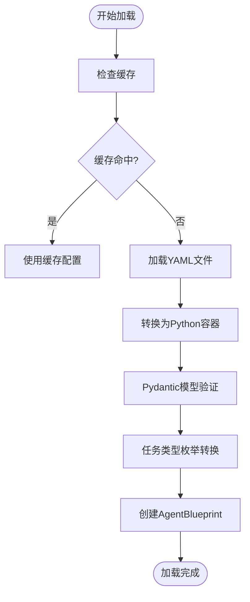
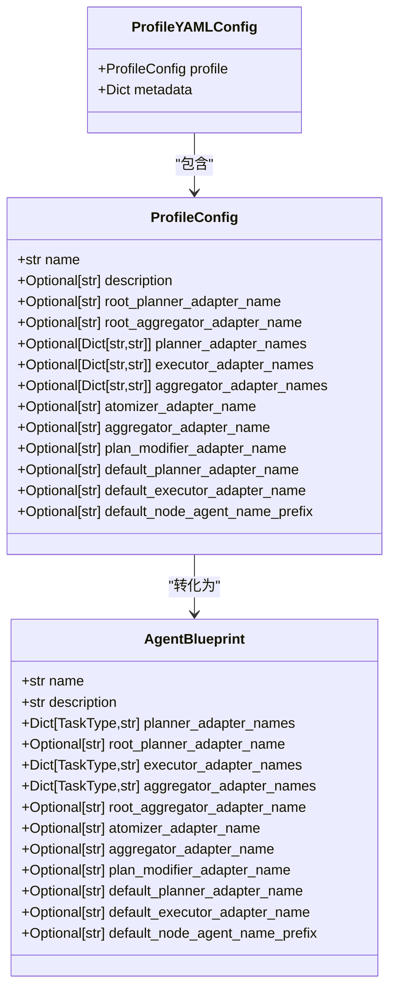
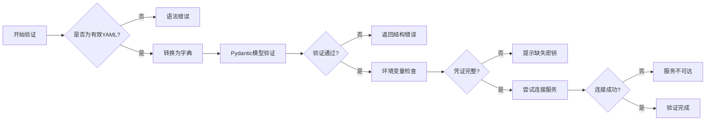
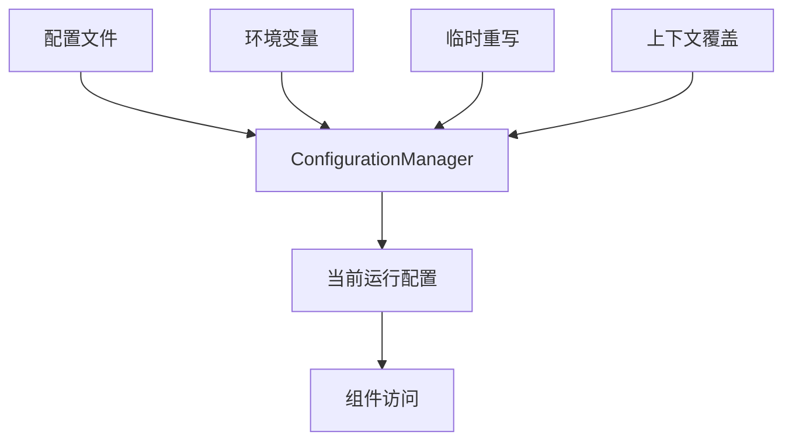

# 代理配置文件通用结构

<cite>
**本文档中引用的文件**  
- [profile_loader.py](file://src\sentientresearchagent\hierarchical_agent_framework\agent_configs\profile_loader.py)
- [agent_factory.py](file://src\sentientresearchagent\hierarchical_agent_framework\agent_configs\agent_factory.py)
- [models.py](file://src\sentientresearchagent\hierarchical_agent_framework\agent_configs\models.py)
- [unified_config.py](file://src\sentientresearchagent\config\unified_config.py)
- [general_agent.yaml](file://src\sentientresearchagent\hierarchical_agent_framework\agent_configs\profiles\general_agent.yaml)
- [deep_research_agent.yaml](file://src\sentientresearchagent\hierarchical_agent_framework\agent_configs\profiles\deep_research_agent.yaml)
- [crypto_analytics_agent.yaml](file://src\sentientresearchagent\hierarchical_agent_framework\agent_configs\profiles\crypto_analytics_agent.yaml)
</cite>

## 目录
1. [引言](#引言)  
2. [核心字段语义定义与约束](#核心字段语义定义与约束)  
3. [配置加载与初始化机制](#配置加载与初始化机制)  
4. [类型规范与嵌套结构](#类型规范与嵌套结构)  
5. [默认值继承规则](#默认值继承规则)  
6. [验证逻辑详解](#验证逻辑详解)  
7. [YAML配置最佳实践示例](#yaml配置最佳实践示例)  
8. [跨层级配置合并机制](#跨层级配置合并机制)  
9. [常见结构错误诊断与修复](#常见结构错误诊断与修复)  
10. [结论](#结论)

## 引言
本文档深入解析代理Profile配置文件的通用结构设计，涵盖`role_definition`、`allowed_tools`、`prompt_templates`、`model_preferences`等核心字段的语义定义与配置约束。详细说明各配置项在`agent_factory`初始化和`profile_loader`加载过程中的作用机制，包括类型规范、嵌套结构、默认值继承规则及验证逻辑。提供符合YAML语法格式的最佳实践示例，并结合代码说明如何通过`UnifiedConfig`实现跨层级配置合并。针对常见结构错误（如缩进错误、类型不匹配）给出诊断与修复方案。

## 核心字段语义定义与约束
代理Profile配置文件的核心字段定义于`ProfileConfig`类中，其主要字段及其语义如下：

- **name**: 代理名称，唯一标识符。
- **description**: 代理描述信息，用于说明该代理的功能和用途。
- **root_planner_adapter_name**: 根节点规划器适配器名称，用于初始任务分解。
- **root_aggregator_adapter_name**: 根节点聚合器适配器名称，用于最终结果合成。
- **planner_adapter_names**: 按任务类型映射的规划器代理名称字典，支持不同任务类型的定制化规划。
- **executor_adapter_names**: 按任务类型映射的执行器代理名称字典，指定不同类型任务的执行策略。
- **aggregator_adapter_names**: 按任务类型映射的聚合器代理名称字典，控制多源结果的整合方式。
- **atomizer_adapter_name**: 原子化处理器名称，负责将复杂任务拆分为子任务。
- **aggregator_adapter_name**: 聚合器名称（向后兼容），作为聚合操作的默认回退选项。
- **plan_modifier_adapter_name**: 计划修改器名称，用于动态调整生成的计划。
- **default_planner_adapter_name**: 默认规划器名称，当特定任务类型无明确规划器时使用。
- **default_executor_adapter_name**: 默认执行器名称，提供通用执行能力。
- **default_node_agent_name_prefix**: 节点代理名称前缀，用于自动生成节点代理名称。

这些字段均通过Pydantic模型进行严格验证，确保配置的合法性与一致性。

**Section sources**
- [models.py](file://src\sentientresearchagent\hierarchical_agent_framework\agent_configs\models.py#L661-L715)

## 配置加载与初始化机制
代理配置文件的加载由`ProfileLoader`类负责，其实现了从YAML文件到`AgentBlueprint`实例的完整转换流程。

### 加载流程
1. **缓存检查**：首先检查是否已存在缓存的有效配置，若存在则直接使用。
2. **文件读取**：调用`OmegaConf.load()`方法加载YAML文件内容。
3. **容器转换**：使用`OmegaConf.to_container(config, resolve=True)`将配置对象转为标准Python字典。
4. **Pydantic验证**：通过`validate_profile_yaml()`函数对字典数据进行结构化验证，生成`ProfileYAMLConfig`实例。
5. **枚举转换**：将字符串形式的任务类型（如"SEARCH"）转换为`TaskType`枚举值。
6. **蓝图创建**：基于验证后的配置构建`AgentBlueprint`实例，完成代理蓝图的初始化。

此过程确保了配置数据在进入系统前已完成全面校验，提升了系统的健壮性。



**Diagram sources**
- [profile_loader.py](file://src\sentientresearchagent\hierarchical_agent_framework\agent_configs\profile_loader.py#L58-L156)

**Section sources**
- [profile_loader.py](file://src\sentientresearchagent\hierarchical_agent_framework\agent_configs\profile_loader.py#L58-L156)

## 类型规范与嵌套结构
代理配置采用严格的类型系统，所有配置均基于Pydantic v2模型定义，确保类型安全与自动验证。

### 主要类型层次


**Diagram sources**
- [models.py](file://src\sentientresearchagent\hierarchical_agent_framework\agent_configs\models.py#L738-L796)
- [agent_blueprints.py](file://src\sentientresearchagent\hierarchical_agent_framework\agent_blueprints.py#L11-L42)

**Section sources**
- [models.py](file://src\sentientresearchagent\hierarchical_agent_framework\agent_configs\models.py#L738-L796)
- [agent_blueprints.py](file://src\sentientresearchagent\hierarchical_agent_framework\agent_blueprints.py#L11-L42)

## 默认值继承规则
代理配置支持多层次的默认值继承机制，以提高配置复用性和灵活性。

### 继承优先级
1. **显式配置值**：直接在配置文件中定义的值具有最高优先级。
2. **环境变量覆盖**：可通过环境变量对部分参数（如API密钥）进行运行时覆盖。
3. **默认字段值**：Pydantic模型中定义的默认值作为最后兜底选项。

例如，在`BinanceToolkitParams`中：
- `data_dir` 默认为 `"./data/binance"`
- `api_key` 默认取自环境变量 `BINANCE_API_KEY`
- 若未设置，则为空字符串并触发验证错误

这种设计既保证了可配置性，又避免了硬编码敏感信息。

**Section sources**
- [models.py](file://src\sentientresearchagent\hierarchical_agent_framework\agent_configs\models.py#L661-L715)

## 验证逻辑详解
配置验证分为静态验证与动态验证两个阶段，确保配置的完整性与可用性。

### 静态验证（Pydantic）
- 字段类型检查
- 必填字段验证
- 枚举值合法性校验（如`TaskType`）
- 字符串格式约束（如API密钥长度）

### 动态验证（运行时）
- API密钥有效性检测（通过网络请求测试）
- 工具集依赖完整性检查
- 模型提供商凭证验证

验证失败时会抛出详细的错误信息，帮助用户快速定位问题。



**Diagram sources**
- [models.py](file://src\sentientresearchagent\hierarchical_agent_framework\agent_configs\models.py#L661-L715)
- [profile_loader.py](file://src\sentientresearchagent\hierarchical_agent_framework\agent_configs\profile_loader.py#L58-L156)

**Section sources**
- [models.py](file://src\sentientresearchagent\hierarchical_agent_framework\agent_configs\models.py#L661-L715)

## YAML配置最佳实践示例
以下是推荐的标准YAML配置模板：

```yaml
profile:
  name: "DataAnalysisAgent"
  description: "Specialized agent for data analysis and insight generation"

  root_planner_adapter_name: "GeneralTaskSolver"
  root_aggregator_adapter_name: "RootGeneralAggregator"

  planner_adapter_names:
    SEARCH: "EnhancedSearchPlanner"
    WRITE: "EnhancedWritePlanner"
    THINK: "EnhancedThinkPlanner"

  executor_adapter_names:
    SEARCH: "OpenAICustomSearcher"
    THINK: "BasicReasoningExecutor"
    WRITE: "BasicReportWriter"

  aggregator_adapter_names:
    SEARCH: "SearchAggregator"
    THINK: "ThinkAggregator"
    WRITE: "WriteAggregator"

  atomizer_adapter_name: "default_atomizer"
  aggregator_adapter_name: "default_aggregator"
  plan_modifier_adapter_name: "PlanModifier"

  default_planner_adapter_name: "GeneralTaskSolver"
  default_executor_adapter_name: "BasicReasoningExecutor"
  default_node_agent_name_prefix: "DataAnalysis"

metadata:
  version: "1.0.0"
  use_case: "Data analysis, statistical research"
  recommended_for:
    - "Statistical analysis"
    - "Market research"
```

**Section sources**
- [general_agent.yaml](file://src\sentientresearchagent\hierarchical_agent_framework\agent_configs\profiles\general_agent.yaml#L1-L47)

## 跨层级配置合并机制
跨层级配置合并由`UnifiedConfig`模块统一管理，通过`ConfigurationManager`单例模式实现。

### 合并策略
1. **基础配置**：从配置文件或默认值加载
2. **环境变量覆盖**：启动时自动应用环境变量
3. **运行时重写**：通过`override()`方法临时修改
4. **上下文临时覆盖**：使用`temporary_override()`上下文管理器

```python
with config_manager.temporary_override(skip_atomization=True):
    # 此区块内 skip_atomization 为 True
    pass
# 自动恢复原配置
```

该机制确保了配置的一致性与可预测性，避免了分散配置带来的混乱。



**Diagram sources**
- [unified_config.py](file://src\sentientresearchagent\config\unified_config.py#L0-L248)

**Section sources**
- [unified_config.py](file://src\sentientresearchagent\config\unified_config.py#L0-L248)

## 常见结构错误诊断与修复
### 缩进错误
**症状**：YAML解析失败，报错“could not determine a constructor”
**修复**：使用统一缩进（建议2或4空格），避免Tab混用

### 类型不匹配
**症状**：`ValidationError`提示字段类型不符
**示例**：将布尔值写成字符串 `"true"` 而非 `true`
**修复**：遵循YAML标量类型规则，布尔值不用引号

### 任务类型拼写错误
**症状**：`Invalid task type key 'searc'` 错误
**修复**：确认`TaskType`合法值为 `SEARCH`, `WRITE`, `THINK`

### 缺失必填字段
**症状**：`field required` 错误
**修复**：参考模板补全`name`, `type`, `adapter_class`等关键字段

### 循环依赖检测
系统会在加载后自动检测组件间的循环依赖关系，并在日志中警告。

**Section sources**
- [profile_loader.py](file://src\sentientresearchagent\hierarchical_agent_framework\agent_configs\profile_loader.py#L58-L156)
- [models.py](file://src\sentientresearchagent\hierarchical_agent_framework\agent_configs\models.py#L661-L715)

## 结论
代理Profile配置文件的设计体现了高内聚、低耦合的原则，通过Pydantic模型实现了强类型约束与自动化验证。`ProfileLoader`与`AgentFactory`协同工作，完成了从静态配置到运行时实例的无缝转化。`UnifiedConfig`提供了灵活的配置覆盖机制，适应不同部署场景的需求。遵循本文档的最佳实践，可有效提升配置的可靠性与可维护性。