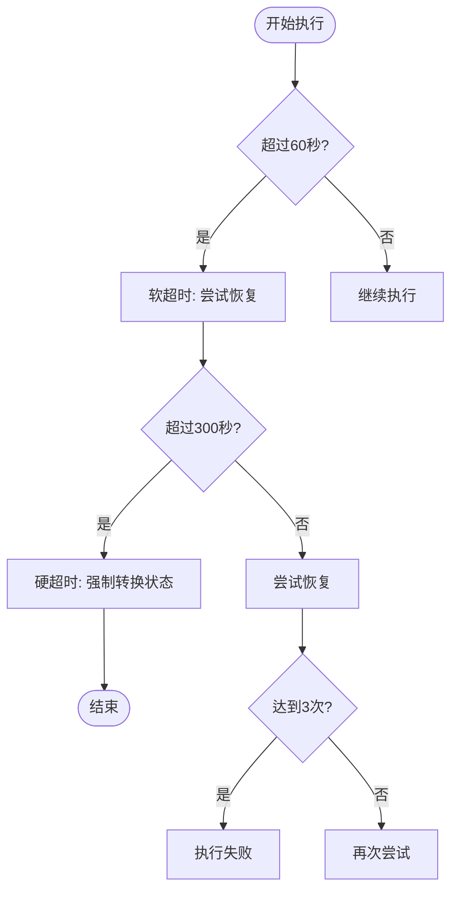
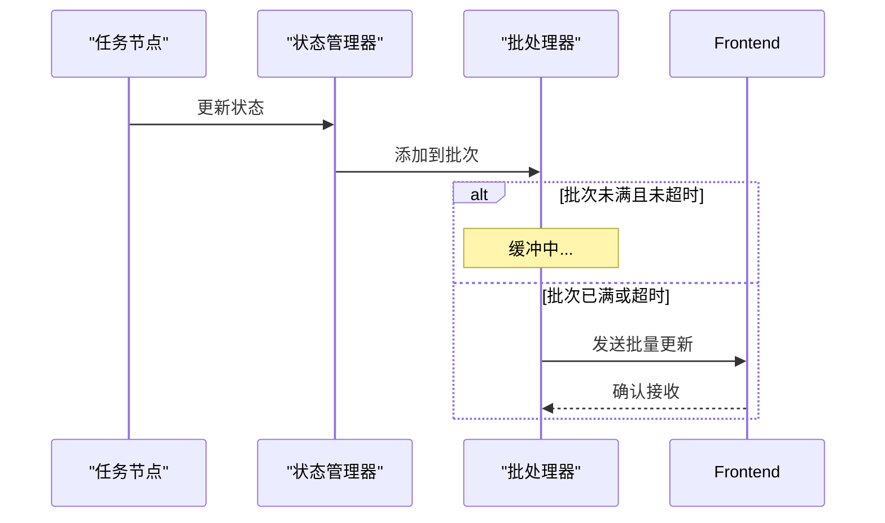
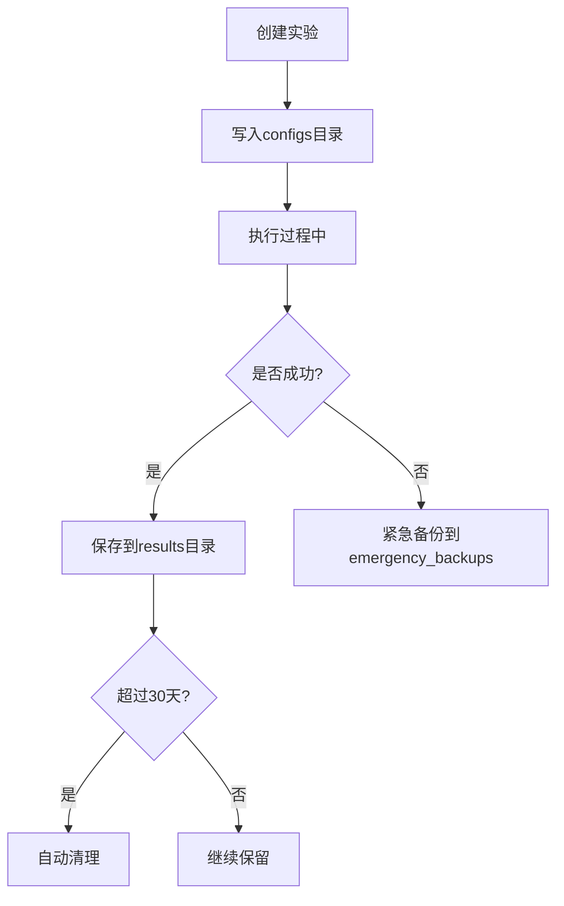

# 全局配置

<cite>
**本文档引用的文件**
- [sentient.yaml](file://sentient.yaml)
- [config.py](file://src/sentientresearchagent/config/config.py)
- [unified_config.py](file://src/sentientresearchagent/config/unified_config.py)
</cite>

## 目录
1. [引言](#引言)
2. [LLM模块配置](#llm模块配置)
3. [缓存模块配置](#缓存模块配置)
4. [执行模块配置](#执行模块配置)
5. [WebSocket优化配置](#websocket优化配置)
6. [日志模块配置](#日志模块配置)
7. [实验管理配置](#实验管理配置)
8. [配置加载机制](#配置加载机制)
9. [部署最佳实践](#部署最佳实践)

## 引言
本全局配置文档详细阐述了`sentient.yaml`中的顶级配置项，聚焦于LLM、缓存、执行和WebSocket等核心模块。文档将深入解析各配置参数的数据类型、默认值及作用范围，并说明如何通过环境变量覆盖配置文件设置。系统采用三层配置优先级机制（环境变量 > 配置文件 > 默认值），确保在不同部署环境下都能灵活调整行为。

**Section sources**
- [sentient.yaml](file://sentient.yaml#L1-L116)

## LLM模块配置
LLM模块负责管理大语言模型的基础架构，是整个框架的核心组件。

### 基础配置
| 参数 | 数据类型 | 默认值 | 作用范围 | 描述 |
|------|--------|-------|--------|------|
| `provider` | 字符串 | `"openrouter"` | LLM提供商选择 | 支持`openai`, `anthropic`, `azure`, `custom`, `openrouter`等 |
| `api_key` | 字符串 | `"your-openrouter-key"` | API密钥管理 | 可通过`OPENROUTER_API_KEY`环境变量覆盖 |
| `timeout` | 浮点数 | `300.0` | 请求超时 | 单位为秒，5分钟超时适用于复杂代码执行和推理 |
| `max_retries` | 整数 | `3` | 错误重试 | 网络请求失败时的最大重试次数 |

### 提供商验证
系统对LLM提供商进行严格验证，仅允许预定义的有效提供商：
```python
valid_providers = ['openai', 'anthropic', 'azure', 'custom', 'openrouter']
```
若指定非标准提供商，系统会发出警告但仍允许使用。

[SPEC SYMBOL](file://src/sentientresearchagent/config/config.py#L21-L43)

**Section sources**
- [sentient.yaml](file://sentient.yaml#L5-L9)
- [config.py](file://src/sentientresearchagent/config/config.py#L21-L43)

## 缓存模块配置
缓存系统用于存储代理响应，提升性能并减少重复计算。

### 核心参数
| 参数 | 数据类型 | 默认值 | 作用范围 | 描述 |
|------|--------|-------|--------|------|
| `enabled` | 布尔值 | `true` | 缓存开关 | 启用或禁用整个缓存系统 |
| `cache_type` | 字符串 | `"file"` | 缓存后端类型 | 支持`memory`(内存), `redis`(Redis), `file`(文件) |
| `ttl_seconds` | 整数 | `7200` | 缓存生存时间 | 缓存条目存活时间，单位为秒（2小时） |
| `max_size` | 整数 | `500` | 缓存容量 | 最大缓存条目数量 |

### Redis特殊校验
当启用Redis缓存时，系统强制要求提供`redis_url`：
```python
if enabled and cache_type == "redis" and not redis_url:
    raise ValueError("Redis cache enabled but no redis_url provided")
```

### 缓存目录管理
缓存目录自动设置为`runtime/cache/agent`，遵循统一的运行时路径管理：
```python
def get_cache_directory(self) -> Path:
    if self.cache_dir:
        return Path(self.cache_dir)
    else:
        paths = RuntimePaths.get_default()
        return paths.get_cache_path("agent")
```

[SPEC SYMBOL](file://src/sentientresearchagent/config/config.py#L45-L77)

**Section sources**
- [sentient.yaml](file://sentient.yaml#L12-L16)
- [config.py](file://src/sentientresearchagent/config/config.py#L45-L77)

## 执行模块配置
执行框架控制任务的并发处理、超时策略和人机交互流程。

### 并发与速率控制
| 参数 | 数据类型 | 默认值 | 作用范围 | 描述 |
|------|--------|-------|--------|------|
| `max_concurrent_nodes` | 整数 | `10` | 并发节点数 | 最大同时执行的节点数量 |
| `max_parallel_nodes` | 整数 | `8` | 并行批处理 | 单批次最大并行处理的节点数 |
| `rate_limit_rpm` | 整数 | `30` | 速率限制 | 每分钟请求数限制，避免API限流 |

### 超时与恢复策略


**Diagram sources**
- [sentient.yaml](file://sentient.yaml#L24-L33)
- [config.py](file://src/sentientresearchagent/config/config.py#L79-L287)

#### 超时层级
- **警告阈值**: `warning_threshold_seconds: 60.0` - 检测卡住的节点
- **软超时**: `soft_timeout_seconds: 180.0` - 尝试恢复
- **硬超时**: `hard_timeout_seconds: 300.0` - 强制状态转换

#### 恢复机制
- `max_recovery_attempts`: 每个节点最大恢复尝试次数（3次）
- `enable_aggressive_recovery`: 是否启用激进恢复策略应对死锁

[SPEC SYMBOL](file://src/sentientresearchagent/config/config.py#L79-L287)

**Section sources**
- [sentient.yaml](file://sentient.yaml#L19-L33)
- [config.py](file://src/sentientresearchagent/config/config.py#L79-L287)

## WebSocket优化配置
WebSocket模块经过深度优化，以提高实时通信效率。

### 批处理与压缩
| 参数 | 数据类型 | 默认值 | 作用范围 | 描述 |
|------|--------|-------|--------|------|
| `ws_batch_size` | 整数 | `50` | 批量大小 | WebSocket消息批量发送的数量 |
| `ws_batch_timeout_ms` | 整数 | `100` | 批处理超时 | 最大等待毫秒数后强制发送批次 |
| `enable_ws_compression` | 布尔值 | `true` | 压缩开关 | 启用WebSocket负载压缩 |
| `enable_diff_updates` | 布尔值 | `true` | 差异更新 | 仅发送变化的部分数据 |

### 状态管理优化


**Diagram sources**
- [sentient.yaml](file://sentient.yaml#L28-L31)
- [config.py](file://src/sentientresearchagent/config/config.py#L79-L287)

**Section sources**
- [sentient.yaml](file://sentient.yaml#L28-L31)
- [config.py](file://src/sentientresearchagent/config/config.py#L79-L287)

## 日志模块配置
日志系统提供清晰可读的输出，便于监控和调试。

### 日志级别与输出
| 参数 | 数据类型 | 默认值 | 作用范围 | 描述 |
|------|--------|-------|--------|------|
| `level` | 字符串 | `"INFO"` | 日志级别 | TRACE, DEBUG, INFO, WARNING, ERROR, CRITICAL |
| `enable_console` | 布尔值 | `true` | 控制台输出 | 是否启用控制台日志 |
| `enable_file` | 布尔值 | `true` | 文件输出 | 是否启用文件日志 |
| `console_style` | 字符串 | `"clean"` | 控制台样式 | clean, timestamp, detailed |

### 模块级日志控制
```yaml
module_levels:
  "sentientresearchagent.server.services.broadcast_service": "WARNING"
  "sentientresearchagent.server.services.project_service": "WARNING"
  "sentientresearchagent.core.project_manager": "WARNING"
  "sentientresearchagent.hierarchical_agent_framework.graph.graph_serializer": "WARNING"
```
此配置可抑制特定模块的冗余日志，保持输出整洁。

[SPEC SYMBOL](file://src/sentientresearchagent/config/config.py#L300-L327)

**Section sources**
- [sentient.yaml](file://sentient.yaml#L48-L68)
- [config.py](file://src/sentientresearchagent/config/config.py#L300-L327)

## 实验管理配置
实验配置模块管理所有实验相关的文件组织和生命周期。

### 目录结构
| 参数 | 数据类型 | 默认值 | 作用范围 | 描述 |
|------|--------|-------|--------|------|
| `base_dir` | 字符串 | `"experiments"` | 基础目录 | 所有实验的根目录 |
| `results_dir` | 字符串 | `"results"` | 结果目录 | 存储实验结果 |
| `retention_days` | 整数 | `30` | 保留天数 | 自动清理旧结果的天数 |

### 生命周期管理


**Diagram sources**
- [sentient.yaml](file://sentient.yaml#L70-L78)
- [config.py](file://src/sentientresearchagent/config/config.py#L350-L376)

**Section sources**
- [sentient.yaml](file://sentient.yaml#L70-L78)
- [config.py](file://src/sentientresearchagent/config/config.py#L350-L376)

## 配置加载机制
系统采用多层配置加载机制，确保灵活性和可维护性。

### 加载优先级


**Diagram sources**
- [config.py](file://src/sentientresearchagent/config/config.py#L596-L637)
- [unified_config.py](file://src/sentientresearchagent/config/unified_config.py#L16-L215)

### 环境变量映射
| 环境变量 | 对应配置项 | 类型转换 |
|---------|-----------|--------|
| `SENTIENT_LLM_PROVIDER` | `llm.provider` | 字符串 |
| `SENTIENT_MAX_CONCURRENT` | `execution.max_concurrent_nodes` | 整数 |
| `SENTIENT_EXECUTION_TIMEOUT` | `execution.node_execution_timeout_seconds` | 浮点数 |
| `SENTIENT_ENABLE_HITL` | `execution.enable_hitl` | 布尔值 |

### 配置合并逻辑
```python
def merge_with(self, other: "SentientConfig") -> "SentientConfig":
    def deep_merge(base: dict, overlay: dict) -> dict:
        result = base.copy()
        for key, value in overlay.items():
            if key in result and isinstance(result[key], dict) and isinstance(value, dict):
                result[key] = deep_merge(result[key], value)
            else:
                result[key] = value
        return result
```
后加载的配置始终优先于先加载的配置。

[SPEC SYMBOL](file://src/sentientresearchagent/config/config.py#L596-L637)

**Section sources**
- [config.py](file://src/sentientresearchagent/config/config.py#L596-L637)
- [unified_config.py](file://src/sentientresearchagent/config/unified_config.py#L16-L215)

## 部署最佳实践
根据不同部署环境，推荐以下配置策略。

### 开发环境
```bash
export SENTIENT_LOG_LEVEL=DEBUG
export SENTIENT_ENABLE_HITL=true
export SENTIENT_MAX_CONCURRENT=5
```
启用详细日志和人机交互，降低并发数以便调试。

### 生产环境
```bash
export SENTIENT_LLM_PROVIDER=openai
export SENTIENT_LLM_API_KEY=sk-xxxxxxxxxxxxxxxxxxxx
export SENTIENT_CACHE_TYPE=redis
export SENTIENT_REDIS_URL=redis://localhost:6379/0
export SENTIENT_ENABLE_HITL=false
```
使用生产级缓存，禁用人机交互以提高自动化程度。

### 性能调优建议
- **高并发场景**: 增加`max_concurrent_nodes`至15-20，但需注意LLM API配额
- **长任务场景**: 提高`node_execution_timeout_seconds`至7200.0（2小时）
- **资源受限场景**: 设置`cache_type: memory`并降低`max_size`至200

**Section sources**
- [sentient.yaml](file://sentient.yaml#L1-L116)
- [config.py](file://src/sentientresearchagent/config/config.py#L21-L43)