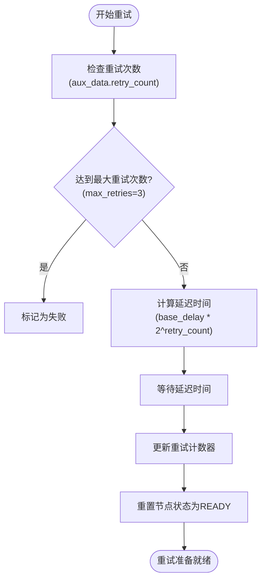
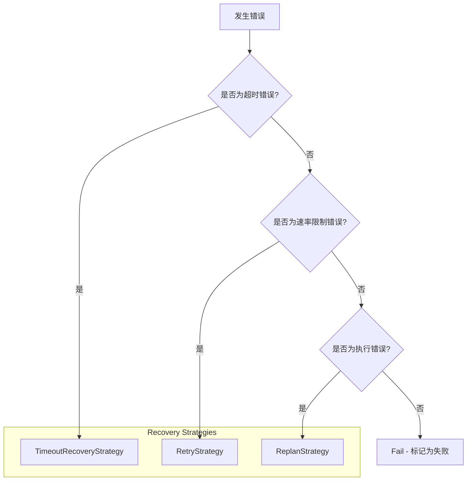
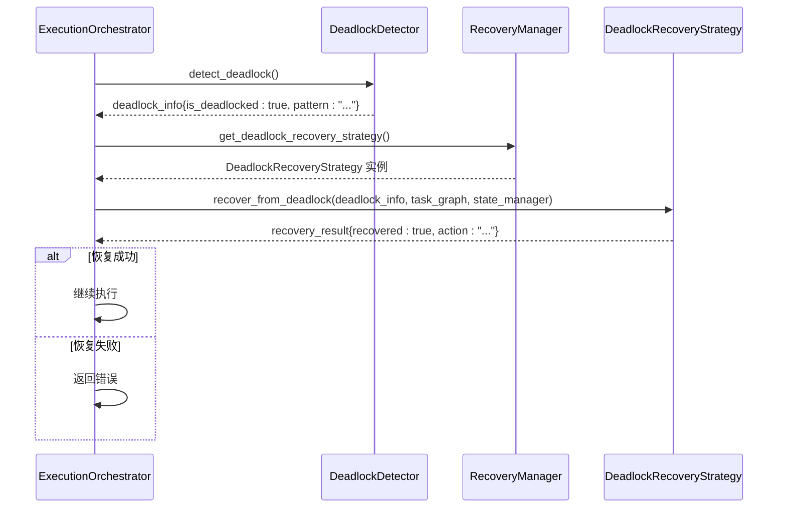
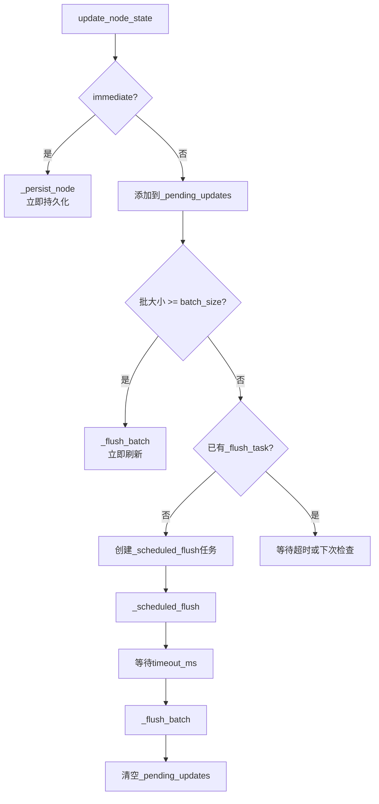
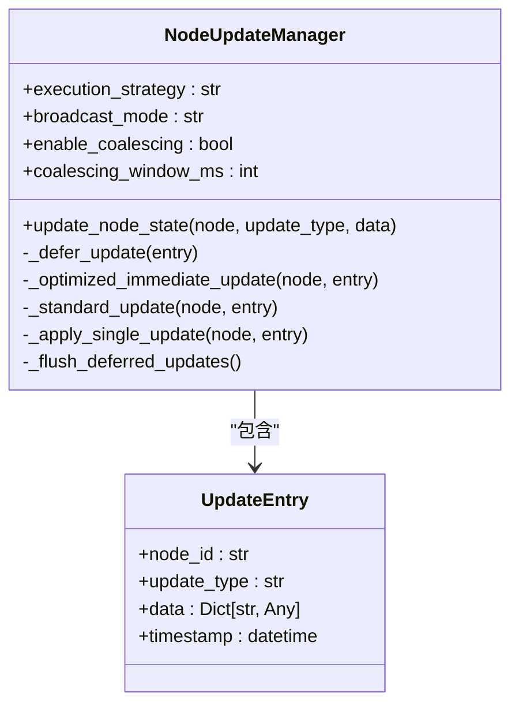

# 执行策略配置

<cite>
**本文档中引用的文件**
- [config.py](file://src\sentientresearchagent\config\config.py)
- [execution_orchestrator.py](file://src\sentientresearchagent\hierarchical_agent_framework\orchestration\execution_orchestrator.py)
- [batched_state_manager.py](file://src\sentientresearchagent\hierarchical_agent_framework\orchestration\batched_state_manager.py)
- [node_update_manager.py](file://src\sentientresearchagent\hierarchical_agent_framework\services\node_update_manager.py)
- [recovery_manager.py](file://src\sentientresearchagent\hierarchical_agent_framework\orchestration\recovery_manager.py)
</cite>

## 目录
1. [执行引擎核心配置](#执行引擎核心配置)
2. [人机协作（HITL）机制](#人机协作hitl机制)
3. [任务重试与恢复策略](#任务重试与恢复策略)
4. [死锁检测与恢复](#死锁检测与恢复)
5. [批量状态管理](#批量状态管理)
6. [节点更新管理](#节点更新管理)
7. [高负载场景配置范例](#高负载场景配置范例)
8. [常见异常的配置解决方案](#常见异常的配置解决方案)

## 执行引擎核心配置

执行引擎的核心配置由 `ExecutionConfig` 类定义，位于 `config.py` 文件中。该配置类控制着任务调度、并发执行、超时限制等关键行为。

主要配置参数包括：
- **max_concurrent_nodes**: 最大并发节点数，控制同时运行的任务数量。
- **max_parallel_nodes**: 最大并行处理节点数，影响批处理模式下的性能。
- **max_execution_steps**: 最大执行步数，防止无限循环。
- **node_execution_timeout_seconds**: 节点执行超时时间，超过此时间将触发超时恢复。
- **rate_limit_rpm**: 每分钟速率限制，用于模拟API调用限制。
- **optimization_level**: 优化级别，可设置为 "conservative"、"balanced" 或 "aggressive"。
- **execution_strategy**: 执行策略，决定节点更新和广播的方式。

这些参数共同决定了系统的执行速度与稳定性之间的平衡。

**Section sources**
- [config.py](file://src\sentientresearchagent\config\config.py#L80-L150)

## 人机协作（HITL）机制

人机协作（Human-in-the-Loop, HITL）机制通过 `enable_hitl` 参数进行全局控制。当启用时，系统会在预设的关键检查点暂停执行，等待人工审核或干预。

### 核心配置参数

| 参数 | 默认值 | 说明 |
| :--- | :--- | :--- |
| enable_hitl | True | 全局开关，启用/禁用人机协作功能 |
| hitl_root_plan_only | True | 是否仅在根节点计划生成时请求人工审核 |
| hitl_after_plan_generation | True | 计划生成后是否请求人工审核 |
| hitl_after_modified_plan | True | 修改计划后是否请求人工审核 |
| hitl_after_atomizer | False | 原子化决策后是否请求人工审核 |
| hitl_before_execute | False | 执行前是否请求人工审核 |

### 工作流程

当 `enable_hitl` 为 `True` 且 `hitl_root_plan_only` 为 `False` 时，系统会根据上述检查点参数，在相应阶段暂停执行，并通过前端界面通知用户进行审核。审核通过后，执行将继续。

**Section sources**
- [config.py](file://src\sentientresearchagent\config\config.py#L110-L140)

## 任务重试与恢复策略

系统内置了多层次的错误恢复机制，确保在遇到临时性故障时能够自动恢复。

### 重试机制



**Diagram sources**
- [recovery_manager.py](file://src\sentientresearchagent\hierarchical_agent_framework\orchestration\recovery_manager.py#L100-L140)
- [config.py](file://src\sentientresearchagent\config\config.py#L83-L84)

### 恢复策略选择

系统根据错误类型自动选择最合适的恢复策略：



**Diagram sources**
- [recovery_manager.py](file://src\sentientresearchagent\hierarchical_agent_framework\orchestration\recovery_manager.py#L250-L350)

**Section sources**
- [recovery_manager.py](file://src\sentientresearchagent\hierarchical_agent_framework\orchestration\recovery_manager.py#L100-L350)

## 死锁检测与恢复

系统通过 `DeadlockDetector` 和 `RecoveryManager` 协同工作，实现对死锁的自动检测与恢复。

### 死锁检测

`ExecutionOrchestrator` 在主执行循环中定期（每50步）调用 `deadlock_detector.detect_deadlock()` 方法来检查系统状态。

### 死锁恢复流程



**Diagram sources**
- [execution_orchestrator.py](file://src\sentientresearchagent\hierarchical_agent_framework\orchestration\execution_orchestrator.py#L738-L759)
- [recovery_manager.py](file://src\sentientresearchagent\hierarchical_agent_framework\orchestration\recovery_manager.py#L475-L477)

**Section sources**
- [execution_orchestrator.py](file://src\sentientresearchagent\hierarchical_agent_framework\orchestration\execution_orchestrator.py#L738-L759)
- [recovery_manager.py](file://src\sentientresearchagent\hierarchical_agent_framework\orchestration\recovery_manager.py#L400-L487)

## 批量状态管理

`BatchedStateManager` 是一个优化的状态管理器，通过批量操作减少I/O开销，提升系统性能。

### 配置参数

| 参数 | 默认值 | 说明 |
| :--- | :--- | :--- |
| state_batch_size | 50 | 批量大小，达到此数量立即刷新 |
| state_batch_timeout_ms | 100 | 批处理超时时间，单位毫秒 |
| enable_state_compression | True | 是否启用状态压缩 |

### 工作原理



**Diagram sources**
- [batched_state_manager.py](file://src\sentientresearchagent\hierarchical_agent_framework\orchestration\batched_state_manager.py#L78-L109)

**Section sources**
- [batched_state_manager.py](file://src\sentientresearchagent\hierarchical_agent_framework\orchestration\batched_state_manager.py#L78-L109)
- [config.py](file://src\sentientresearchagent\config\config.py#L91-L93)

## 节点更新管理

`NodeUpdateManager` 根据 `execution_strategy` 配置，采用不同的节点更新策略，以平衡实时性与系统开销。

### 更新策略对比

| 策略 (execution_strategy) | 广播模式 (broadcast_mode) | 更新方式 | 适用场景 |
| :--- | :--- | :--- | :--- |
| standard | full | 标准更新，每次变更立即广播 | 通用场景 |
| realtime | full/batch | 优化的即时更新，支持更新合并 | ProfiledSentientAgent |
| deferred | none | 延迟更新，LLM调用结束后批量处理 | LightweightSentientAgent |

### 实现逻辑



**Diagram sources**
- [node_update_manager.py](file://src\sentientresearchagent\hierarchical_agent_framework\services\node_update_manager.py#L50-L250)

**Section sources**
- [node_update_manager.py](file://src\sentientresearchagent\hierarchical_agent_framework\services\node_update_manager.py#L50-L250)
- [execution_orchestrator.py](file://src\sentientresearchagent\hierarchical_agent_framework\orchestration\execution_orchestrator.py#L150-L170)

## 高负载场景配置范例

针对高负载场景，建议采用以下配置组合以最大化性能：

```yaml
execution:
  max_concurrent_nodes: 15
  max_parallel_nodes: 12
  optimization_level: "aggressive"
  execution_strategy: "realtime"
  broadcast_mode: "batch"
  enable_update_coalescing: true
  update_coalescing_window_ms: 30
  state_batch_size: 100
  state_batch_timeout_ms: 50
  enable_state_compression: true
  rate_limit_rpm: 50
  max_execution_steps: 1000
```

此配置通过增加并发度、启用激进优化、使用实时更新与合并、增大状态批处理量等方式，显著提升了系统在高负载下的吞吐量。

**Section sources**
- [config.py](file://src\sentientresearchagent\config\config.py#L80-L150)

## 常见异常的配置解决方案

### 问题：系统频繁出现死锁

**现象**：执行长时间停滞，日志显示“INFINITE LOOP DETECTED”。

**解决方案**：
1. 降低 `max_concurrent_nodes` 至 5-8，减少资源竞争。
2. 启用更积极的死锁恢复，确保 `RecoveryManager` 正常工作。
3. 检查任务依赖关系是否存在环路。

### 问题：API调用频繁超限

**现象**：大量 `AgentRateLimitError` 错误。

**解决方案**：
1. 降低 `rate_limit_rpm` 配置值，使其低于实际API限制。
2. 增加 `retry_delay_seconds` 以延长重试间隔。
3. 调整 `optimization_level` 为 "conservative" 以降低请求频率。

### 问题：前端响应延迟高

**现象**：UI更新不及时，用户体验卡顿。

**解决方案**：
1. 将 `execution_strategy` 设为 "realtime" 或 "deferred"。
2. 启用 `enable_update_coalescing` 并减小 `update_coalescing_window_ms`。
3. 使用 "batch" 或 "none" 的 `broadcast_mode` 减少消息量。

### 问题：内存占用过高

**现象**：进程内存持续增长。

**解决方案**：
1. 确保 `enable_state_compression` 为 `True`。
2. 减小 `state_batch_size` 以降低内存峰值。
3. 考虑将 `cache_type` 改为 "redis" 或 "file" 以减轻内存压力。

**Section sources**
- [config.py](file://src\sentientresearchagent\config\config.py#L80-L150)
- [recovery_manager.py](file://src\sentientresearchagent\hierarchical_agent_framework\orchestration\recovery_manager.py#L100-L350)
- [batched_state_manager.py](file://src\sentientresearchagent\hierarchical_agent_framework\orchestration\batched_state_manager.py#L91-L95)