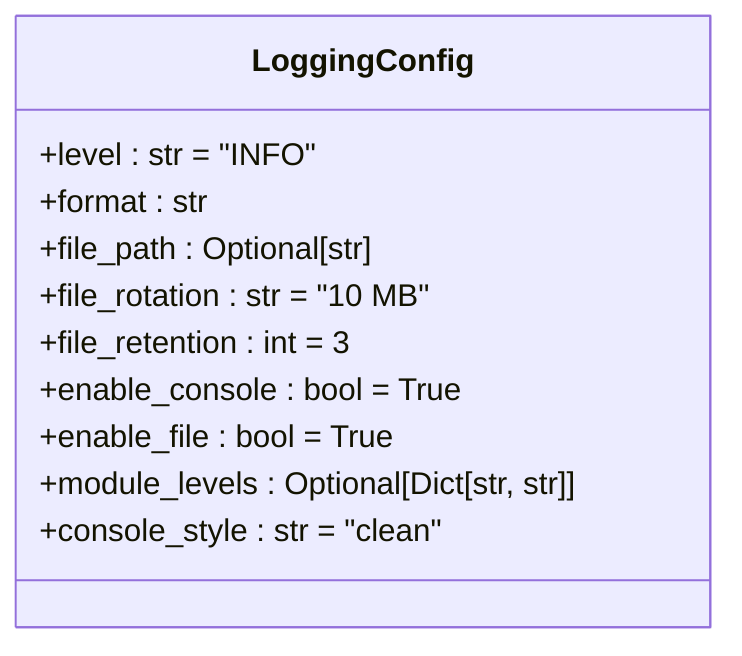
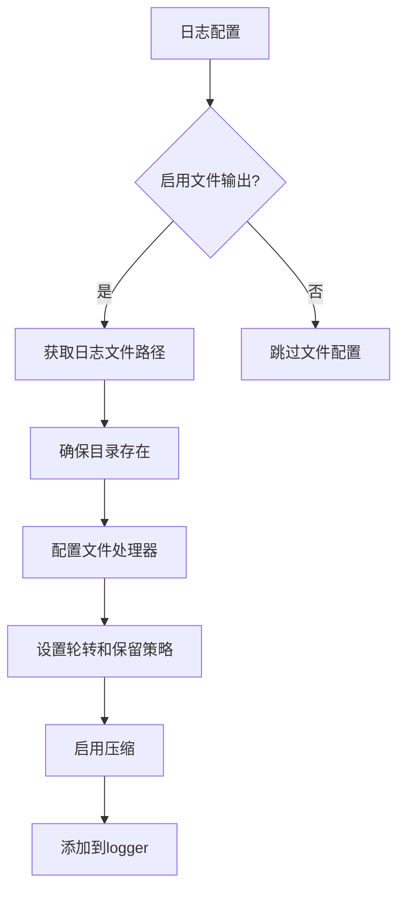
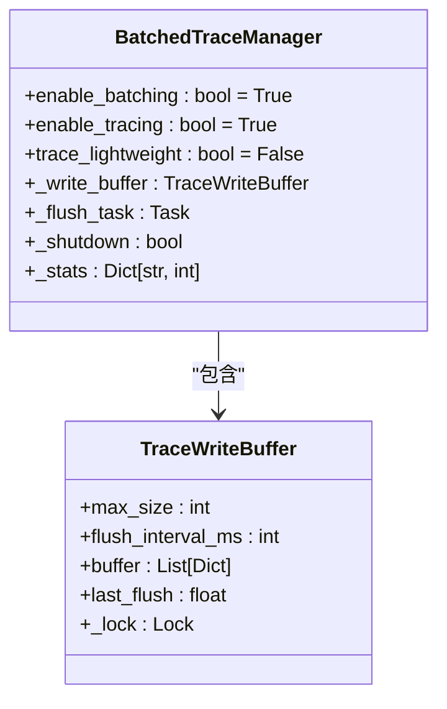
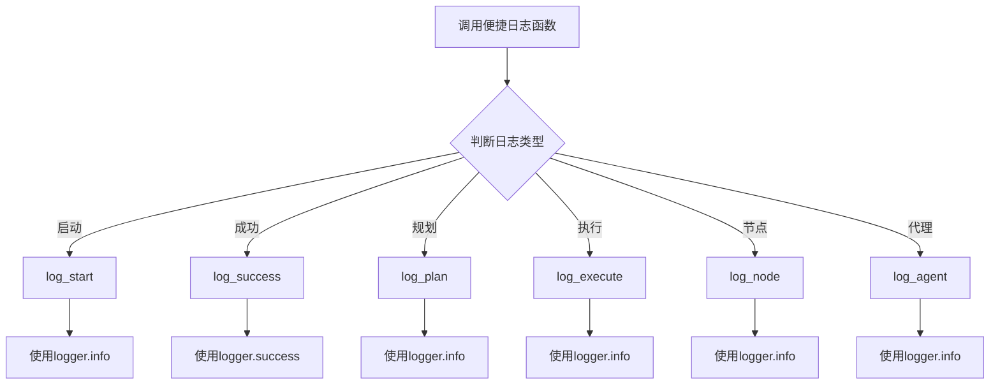

# 日志与监控配置

<cite>
**本文档引用的文件**
- [logging_config.py](file://src/sentientresearchagent/core/logging_config.py)
- [config.py](file://src/sentientresearchagent/config/config.py)
- [paths.py](file://src/sentientresearchagent/config/paths.py)
- [batched_trace_manager.py](file://src/sentientresearchagent/hierarchical_agent_framework/traces/batched_trace_manager.py)
- [sentient.yaml](file://sentient.yaml)
</cite>

## 目录
1. [日志系统概述](#日志系统概述)
2. [日志级别与输出格式](#日志级别与输出格式)
3. [日志目标位置配置](#日志目标位置配置)
4. [结构化日志记录与ELK集成](#结构化日志记录与elk集成)
5. [trace上下文集成](#trace上下文集成)
6. [监控相关配置](#监控相关配置)
7. [自定义日志处理器和过滤器](#自定义日志处理器和过滤器)
8. [生产环境优化方案](#生产环境优化方案)
9. [典型问题排查指南](#典型问题排查指南)

## 日志系统概述

本系统采用Loguru库实现增强型日志记录功能，提供美观可读的日志输出、智能过滤和清晰的格式化。日志系统支持多种配置选项，包括日志级别、输出格式、目标位置以及trace上下文集成。

**Section sources**
- [logging_config.py](file://src/sentientresearchagent/core/logging_config.py#L1-L20)

## 日志级别与输出格式

### 日志级别配置

系统支持以下日志级别：
- TRACE
- DEBUG
- INFO
- SUCCESS
- WARNING
- ERROR
- CRITICAL

在`LoggingConfig`类中，通过`level`字段设置默认日志级别，默认值为"INFO"。该配置会验证输入的级别是否有效，并自动转换为大写形式。



**Diagram sources**
- [config.py](file://src/sentientresearchagent/config/config.py#L300-L327)

### 输出格式选项

系统提供三种控制台输出样式：

1. **clean（默认）**: 纯净模式，仅显示消息内容，带有智能间距和颜色
2. **timestamp**: 时间戳模式，包含HH:mm:ss格式的时间戳
3. **detailed**: 详细模式，包含时间、日志级别、模块名和消息

对于文件输出，使用统一的详细格式：
```
{time:YYYY-MM-DD HH:mm:ss.SSS} | {level: <8} | {name: <40} | {function: <20} | {message}
```

**Section sources**
- [logging_config.py](file://src/sentientresearchagent/core/logging_config.py#L128-L167)

## 日志目标位置配置

### 控制台输出

通过`enable_console`参数控制是否启用控制台输出。当启用时，日志将输出到标准输出流（stdout），并根据配置的样式进行格式化。

### 文件输出

通过`enable_file`参数控制是否启用文件输出。文件输出具有以下特性：

- **路径管理**: 使用`RuntimePaths`类统一管理运行时路径
- **目录创建**: 自动创建必要的日志目录
- **文件轮转**: 支持按大小轮转（默认10MB）
- **保留策略**: 可配置保留的文件数量（默认3个）
- **压缩归档**: 旧日志文件自动压缩为zip格式
- **写入模式**: 支持追加（a）或覆盖（w）模式，可通过LOG_FILE_MODE环境变量配置



**Diagram sources**
- [logging_config.py](file://src/sentientresearchagent/core/logging_config.py#L164-L199)
- [paths.py](file://src/sentientresearchagent/config/paths.py#L11-L147)

**Section sources**
- [logging_config.py](file://src/sentientresearchagent/core/logging_config.py#L164-L199)

## 结构化日志记录与ELK集成

### 结构化日志优势

系统设计支持结构化日志记录，便于与ELK（Elasticsearch, Logstash, Kibana）栈集成分析。文件输出格式已经结构化，包含时间戳、日志级别、模块名、函数名和消息内容，各字段用竖线分隔，便于日志收集工具解析。

### ELK兼容性配置

为了更好地支持ELK分析，建议在生产环境中：

1. 将日志级别设置为"INFO"或更高，减少噪声
2. 启用文件输出，并配置适当的轮转策略
3. 使用JSON格式（虽然当前为文本格式，但结构清晰可解析）
4. 配置Logstash过滤器以提取关键字段

**Section sources**
- [logging_config.py](file://src/sentientresearchagent/core/logging_config.py#L164-L199)

## trace上下文集成

### Trace管理器配置

系统使用`BatchedTraceManager`实现高性能的trace跟踪，其主要配置项包括：

- `enable_tracing`: 是否启用追踪功能
- `enable_batching`: 是否启用批处理写入
- `batch_size`: 批处理大小（默认100）
- `flush_interval_ms`: 刷新间隔（默认5000毫秒）
- `trace_lightweight`: 是否追踪轻量级操作



**Diagram sources**
- [batched_trace_manager.py](file://src/sentientresearchagent/hierarchical_agent_framework/traces/batched_trace_manager.py#L61-L274)

### 动态启停追踪

系统支持动态启用和禁用追踪功能：

- `disable_tracing()`: 禁用所有追踪，同时刷新待处理的追踪数据
- `enable_tracing()`: 重新启用追踪功能

这使得可以在需要时开启详细追踪，在正常运行时关闭以降低开销。

**Section sources**
- [batched_trace_manager.py](file://src/sentientresearchagent/hierarchical_agent_framework/traces/batched_trace_manager.py#L259-L274)

## 监控相关配置

### 性能指标上报

系统通过`get_optimization_stats()`方法提供优化统计信息，包括：

- 追踪记录数
- 批次写入数
- 跳过的追踪数
- 批处理状态
- 追踪启用状态
- 缓冲区大小

这些指标可用于监控系统的运行状况和性能表现。

### 采样率配置

虽然没有显式的采样率配置，但系统通过`trace_lightweight`参数实现了类似功能：

- 当`trace_lightweight=False`且执行策略为"deferred"时，轻量级追踪会被跳过
- 这种机制可以有效降低日志开销，同时保留关键操作的追踪信息

**Section sources**
- [batched_trace_manager.py](file://src/sentientresearchagent/hierarchical_agent_framework/traces/batched_trace_manager.py#L244-L258)

## 自定义日志处理器和过滤器

### 模块级日志过滤

系统支持基于模块的细粒度日志级别控制。通过`module_levels`配置项，可以为不同模块设置不同的日志级别。

```python
def create_module_filter(module_levels: Dict[str, str]):
    """
    基于模块特定日志级别创建过滤器函数。
    
    Args:
        module_levels: 模块名称到日志级别的映射字典
        
    Returns:
        loguru的过滤器函数
    """
```

例如，在`sentient.yaml`中配置：
```yaml
logging:
  module_levels:
    "sentientresearchagent.server.services.broadcast_service": "WARNING"
```

这将使广播服务只记录警告及以上级别的日志。

### 便捷日志函数

系统提供了多个便捷的日志函数，用于标准化常见日志事件：

- `log_start(message)`: 记录启动事件
- `log_success(message)`: 记录成功事件
- `log_plan(message)`: 记录规划事件
- `log_execute(message)`: 记录执行事件
- `log_node(node_id, message)`: 记录节点相关事件
- `log_agent(agent_name, message)`: 记录代理相关事件



**Diagram sources**
- [logging_config.py](file://src/sentientresearchagent/core/logging_config.py#L239-L276)

**Section sources**
- [logging_config.py](file://src/sentientresearchagent/core/logging_config.py#L196-L244)

## 生产环境优化方案

### 降低日志开销的策略

在生产环境中，为平衡可观测性和性能开销，建议采用以下配置：

1. **合理设置日志级别**: 使用"INFO"级别，避免过多DEBUG日志
2. **过滤噪声日志**: 通过`module_levels`配置，将非关键组件的日志级别设为"WARNING"
3. **禁用诊断信息**: 在文件日志中设置`diagnose=False`，不记录变量值
4. **启用批处理**: 对于trace数据，启用批处理写入以减少I/O操作
5. **定期轮转**: 配置合理的文件轮转和保留策略

### 推荐的生产配置

```yaml
logging:
  level: "INFO"
  enable_console: true
  enable_file: true
  file_rotation: "10 MB"
  file_retention: 7
  console_style: "clean"
  module_levels:
    "sentientresearchagent.server.services.broadcast_service": "WARNING"
    "sentientresearchagent.core.cache": "WARNING"
```

**Section sources**
- [sentient.yaml](file://sentient.yaml#L56-L88)

## 典型问题排查指南

### 日志定位方法

当遇到问题时，可通过以下步骤定位相关日志：

1. **查看时间范围**: 根据问题发生时间查找对应时间段的日志
2. **搜索关键词**: 使用组件标识符（如"server"、"agent"、"task"）或状态标识（如"error"、"warning"）进行搜索
3. **检查关键组件**: 
   - 服务器问题：搜索"server"或"websocket"
   - 代理问题：搜索"agent"或具体代理名称
   - 任务问题：搜索"task"或"node"
4. **追踪执行流程**: 使用`log_section()`创建的章节分隔符，按逻辑区块浏览日志

### 常见问题模式

| 问题类型 | 关键词 | 相关日志级别 |
|--------|------|-----------|
| 启动失败 | "start", "initialize" | ERROR, CRITICAL |
| 执行超时 | "timeout", "execute" | WARNING, ERROR |
| 连接问题 | "websocket", "connect" | ERROR |
| 配置错误 | "config", "validate" | ERROR |
| 性能瓶颈 | "slow", "delay" | WARNING |

**Section sources**
- [logging_config.py](file://src/sentientresearchagent/core/logging_config.py#L56-L97)