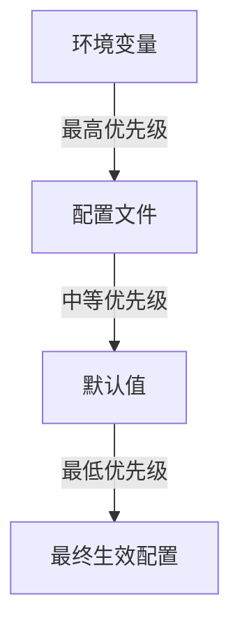
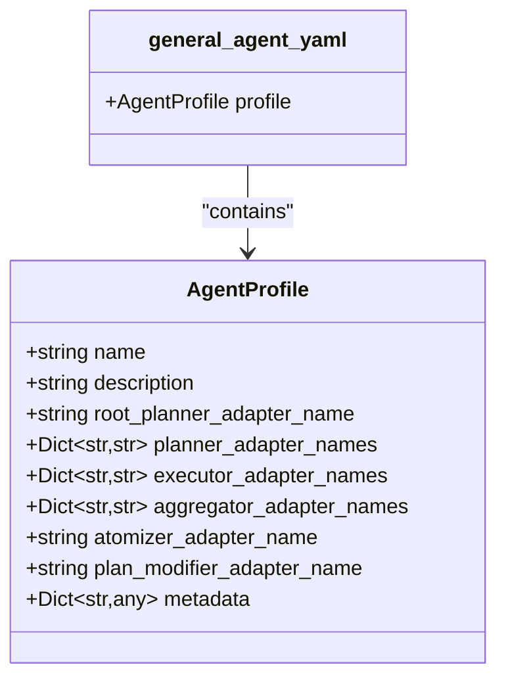

# 配置指南

<cite>
**本文档中引用的文件**  
- [sentient.yaml](file://sentient.yaml)
- [config.py](file://src/sentientresearchagent/config/config.py)
- [unified_config.py](file://src/sentientresearchagent/config/unified_config.py)
- [general_agent.yaml](file://src/sentientresearchagent/hierarchical_agent_framework/agent_configs/profiles/general_agent.yaml)
- [agents.yaml](file://src/sentientresearchagent/hierarchical_agent_framework/agent_configs/agents.yaml)
</cite>

## 目录
1. [简介](#简介)
2. [配置优先级](#配置优先级)
3. [顶级配置块详解](#顶级配置块详解)
   1. [LLM 配置](#llm-配置)
   2. [缓存配置](#缓存配置)
   3. [执行配置](#执行配置)
   4. [日志配置](#日志配置)
   5. [实验配置](#实验配置)
4. [代理特定配置](#代理特定配置)
5. [最佳实践](#最佳实践)
6. [常见配置错误排查](#常见配置错误排查)
7. [性能调优与功能开关](#性能调优与功能开关)

## 简介
本指南旨在为用户提供通过YAML文件全面定制ROMA行为的详细说明。以`sentient.yaml`为核心，深入解析各个顶级配置块（如llm、cache、execution、logging等）的含义与可选值。内容涵盖如何切换LLM提供商、调整并发节点数（max_concurrent_nodes）、启用人机协作（enable_hitl）等关键功能。同时介绍代理特定配置文件（如general_agent.yaml）的结构，包括提示词模板和工具集定义，并提供生产环境下的超时设置、日志级别调整等最佳实践建议。

**Section sources**
- [sentient.yaml](file://sentient.yaml#L1-L116)

## 配置优先级
ROMA框架遵循明确的配置优先级规则，确保配置的灵活性和可控性。优先级从高到低依次为：

1. **环境变量**：具有最高优先级，可用于动态覆盖其他配置。
2. **配置文件**：次之，包含在`sentient.yaml`等文件中的静态配置。
3. **默认值**：最低优先级，当上述两者均未指定时使用。

此机制允许用户在不同环境中灵活调整配置，例如在生产环境中通过环境变量快速修改关键参数而无需更改配置文件。

**Diagram sources**
- [config.py](file://src/sentientresearchagent/config/config.py#L596-L637)
- [unified_config.py](file://src/sentientresearchagent/config/unified_config.py#L16-L215)

**Section sources**
- [config.py](file://src/sentientresearchagent/config/config.py#L596-L637)
- [unified_config.py](file://src/sentientresearchagent/config/unified_config.py#L16-L215)

## 顶级配置块详解

### LLM 配置
`llm`配置块用于定义大语言模型（LLM）的基础设施设置，直接影响代理的推理能力和响应质量。

- `provider`: 指定LLM提供商，支持`openai`, `anthropic`, `azure`, `custom`, `openrouter`等选项。
- `api_key`: 提供商的API密钥，也可通过环境变量`OPENROUTER_API_KEY`等方式注入。
- `timeout`: 设置请求超时时间（秒），建议复杂任务设为300.0秒以上。
- `max_retries`: 请求失败后的最大重试次数。

该配置决定了系统与外部AI服务交互的核心方式。

**Section sources**
- [sentient.yaml](file://sentient.yaml#L5-L8)
- [config.py](file://src/sentientresearchagent/config/config.py#L21-L43)

### 缓存配置
`cache`配置块管理系统的缓存策略，提升重复查询的响应速度并减少API调用成本。

- `enabled`: 是否启用缓存功能。
- `cache_type`: 缓存类型，可选`memory`, `redis`, `file`，其中`file`类型可实现跨会话持久化。
- `ttl_seconds`: 缓存项的生存时间（秒），例如7200秒表示2小时。
- `max_size`: 最大缓存条目数量。

合理配置缓存有助于优化系统性能和资源利用率。

**Section sources**
- [sentient.yaml](file://sentient.yaml#L11-L15)
- [config.py](file://src/sentientresearchagent/config/config.py#L45-L77)

### 执行配置
`execution`配置块是控制系统执行行为的核心，涉及并发、超时、人机协作等多个方面。

- `max_concurrent_nodes`: 最大并发处理的节点数，影响整体执行效率。
- `max_parallel_nodes`: 并行批处理的最大节点数。
- `enable_hitl`: 是否启用人机协作（Human-in-the-Loop）。
- `hitl_timeout_seconds`: 人工干预等待超时时间。
- `node_execution_timeout_seconds`: 单个节点执行的最大超时时间。
- `skip_atomization`: 是否跳过原子化步骤，强制使用递归深度规则。
- `force_root_node_planning`: 是否强制根节点始终进行规划。

此外，还包含状态管理和WebSocket优化相关参数，如批量大小、压缩选项等。

**Section sources**
- [sentient.yaml](file://sentient.yaml#L18-L78)
- [config.py](file://src/sentientresearchagent/config/config.py#L79-L287)

### 日志配置
`logging`配置块控制系统的日志输出行为，便于监控和调试。

- `level`: 日志级别，支持`TRACE`, `DEBUG`, `INFO`, `WARNING`, `ERROR`, `CRITICAL`。
- `enable_console`: 是否启用控制台日志输出。
- `enable_file`: 是否启用文件日志输出。
- `file_rotation`: 日志文件轮转策略，如"10 MB"按大小轮转。
- `file_retention`: 保留的日志文件数量。
- `console_style`: 控制台输出样式，可选`clean`, `timestamp`, `detailed`。
- `module_levels`: 各模块的独立日志级别，用于过滤噪音日志。

**Section sources**
- [sentient.yaml](file://sentient.yaml#L81-L104)
- [config.py](file://src/sentientresearchagent/config/config.py#L300-L327)

### 实验配置
`experiment`配置块管理实验数据的存储与清理策略。

- `base_dir`: 实验输出的根目录。
- `results_dir`: 结果子目录。
- `emergency_backup_dir`: 紧急备份子目录。
- `configs_dir`: 实验配置子目录。
- `retention_days`: 自动清理前保留天数。
- `auto_cleanup`: 是否自动清理旧结果。

**Section sources**
- [sentient.yaml](file://sentient.yaml#L107-L113)
- [config.py](file://src/sentientresearchagent/config/config.py#L350-L376)

## 代理特定配置
代理特定配置文件（位于`src/sentientresearchagent/hierarchical_agent_framework/agent_configs/profiles/`目录下）定义了不同类型代理的行为特征。

以`general_agent.yaml`为例，其核心结构包括：

- `profile.name`: 代理名称。
- `root_planner_adapter_name`: 根规划器适配器名称。
- `planner_adapter_names`: 不同任务类型的规划器映射。
- `executor_adapter_names`: 执行器映射。
- `aggregator_adapter_names`: 聚合器映射。
- `atomizer_adapter_name`: 原子化适配器。
- `plan_modifier_adapter_name`: 计划修改器。
- `metadata`: 元数据，描述代理的用途和推荐场景。

这些配置文件通过提示词模板和工具集定义，实现了对代理能力的精细化控制。

**Diagram sources**
- [general_agent.yaml](file://src/sentientresearchagent/hierarchical_agent_framework/agent_configs/profiles/general_agent.yaml#L1-L46)
- [models.py](file://src/sentientresearchagent/hierarchical_agent_framework/agent_configs/models.py#L573-L710)

**Section sources**
- [general_agent.yaml](file://src/sentientresearchagent/hierarchical_agent_framework/agent_configs/profiles/general_agent.yaml#L1-L46)
- [models.py](file://src/sentientresearchagent/hierarchical_agent_framework/agent_configs/models.py#L573-L710)

## 最佳实践
为确保系统稳定高效运行，建议遵循以下最佳实践：

- **生产环境超时设置**：将`node_execution_timeout_seconds`设为2400.0秒（40分钟），避免因长时间任务被意外中断。
- **日志级别调整**：生产环境使用`INFO`级别，开发环境可使用`DEBUG`或`TRACE`以获取更多细节。
- **并发控制**：根据LLM提供商的速率限制合理设置`max_concurrent_nodes`和`rate_limit_rpm`，避免触发限流。
- **缓存策略**：启用文件缓存并设置合理的TTL，显著提升重复查询性能。
- **安全配置**：生产环境中务必通过环境变量设置`FLASK_SECRET_KEY`，避免使用默认值。

**Section sources**
- [sentient.yaml](file://sentient.yaml#L1-L116)
- [config.py](file://src/sentientresearchagent/config/config.py#L329-L348)

## 常见配置错误排查
以下是常见配置问题及其解决方案：

- **API密钥缺失**：检查`llm.api_key`是否正确设置，或相应环境变量是否已导出。
- **缓存路径无效**：若使用`file`缓存，请确认运行时目录权限正常。
- **端口冲突**：检查`web_server.port`是否被其他进程占用。
- **日志文件无法写入**：确认日志目录存在且有写权限。
- **HITL功能未生效**：确保`enable_hitl`为`true`且前端连接正常。
- **代理配置不加载**：验证`default_profile`指向的YAML文件存在于正确路径。

**Section sources**
- [config.py](file://src/sentientresearchagent/config/config.py#L596-L637)
- [unified_config.py](file://src/sentientresearchagent/config/unified_config.py#L241-L243)

## 性能调优与功能开关
通过配置可实现精细的性能调优和功能开关：

- **性能调优**：
  - 增加`max_concurrent_nodes`以提高并行度。
  - 启用`enable_state_compression`和`enable_ws_compression`减少网络开销。
  - 调整`state_batch_size`和`ws_batch_size`优化批量处理效率。

- **功能开关**：
  - `enable_hitl: false` 完全关闭人机协作。
  - `skip_atomization: true` 强制跳过原子化，简化执行流程。
  - `force_root_node_planning: true` 确保复杂查询总能分解。

这些配置使得ROMA能够灵活适应从简单查询到复杂研究的各种应用场景。

**Section sources**
- [sentient.yaml](file://sentient.yaml#L18-L78)
- [config.py](file://src/sentientresearchagent/config/config.py#L79-L287)