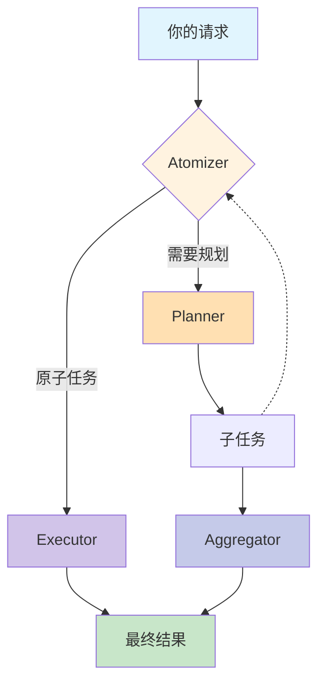

# 项目概述

<cite>
**本文档中引用的文件**  
- [README.md](file://README.md)
- [framework_entry.py](file://src\sentientresearchagent\framework_entry.py)
- [system_manager.py](file://src\sentientresearchagent\core\system_manager.py)
- [node_processor.py](file://src\sentientresearchagent\hierarchical_agent_framework\node\node_processor.py)
- [execution_orchestrator.py](file://src\sentientresearchagent\hierarchical_agent_framework\orchestration\execution_orchestrator.py)
- [plan_handler.py](file://src\sentientresearchagent\hierarchical_agent_framework\node_handlers\plan_handler.py)
- [execute_handler.py](file://src\sentientresearchagent\hierarchical_agent_framework\node_handlers\execute_handler.py)
- [aggregate_handler.py](file://src\sentientresearchagent\hierarchical_agent_framework\node_handlers\aggregate_handler.py)
</cite>

## 目录
1. [引言](#引言)
2. [核心架构与递归机制](#核心架构与递归机制)
3. [四大核心组件](#四大核心组件)
4. [信息流与任务依赖](#信息流与任务依赖)
5. [系统上下文图](#系统上下文图)
6. [性能基准与成果](#性能基准与成果)
7. [项目价值主张](#项目价值主张)
8. [技术深度与创新点](#技术深度与创新点)

## 引言

ROMA（Recursive Open Meta-Agents）是一个元代理框架，旨在通过递归分层结构解决复杂的研究任务。该框架将大型问题分解为可并行处理的子任务，从而实现高效、透明的问题求解过程。其设计灵感来源于“超越大纲：异构递归规划”这一研究理念，并结合了现代AI代理系统的最佳实践。

本项目不仅提供了一个强大的自动化研究工具，还强调社区驱动的扩展性，允许开发者创建和共享自定义代理。无论是初学者还是高级开发者，都能从ROMA的设计中受益——前者可以轻松理解其工作流程，后者则能深入探索其模块化架构与优化策略。

**Section sources**
- [README.md](file://README.md#L1-L100)

## 核心架构与递归机制

ROMA的核心在于其递归的“计划-执行”循环机制（plan-execute loop），该机制使系统能够智能地决定何时将任务进一步细分，以及何时直接执行原子任务。整个流程由一个简洁但功能强大的函数驱动：

```python
def solve(task):
    if is_atomic(task):                 # Step 1: Atomizer
        return execute(task)            # Step 2: Executor
    else:
        subtasks = plan(task)           # Step 2: Planner
        results = []
        for subtask in subtasks:
            results.append(solve(subtask))  # Recursive call
        return aggregate(results)       # Step 3: Aggregator
```

此递归逻辑确保了无论任务多么复杂，系统都可以通过不断分解直至达到可执行的最小单元（atomic task），然后逐层聚合结果以形成最终答案。这种结构支持灵活的任务调度、依赖管理以及错误恢复能力。

**Section sources**
- [README.md](file://README.md#L150-L200)
- [framework_entry.py](file://src\sentientresearchagent\framework_entry.py#L100-L150)

## 四大核心组件

### Atomizer（原子化器）

Atomizer负责判断输入请求是否为“原子任务”，即可以直接执行而无需进一步规划的任务。如果任务过于复杂，则交由Planner进行分解。该决策基于任务内容、当前上下文及配置参数（如最大递归深度）综合得出。

### Planner（规划器）

当任务需要分解时，Planner会将其拆分为多个更小的子任务。每个子任务随后被重新送入Atomizer进行评估，从而形成递归调用链。Planner利用专门的LLM代理生成结构化的子任务列表，并可通过人工干预（HITL, Human-in-the-loop）进行审查或修改。

### Executor（执行器）

Executor处理所有被判定为原子级别的任务。它可以是任何实现了`agent.execute()`接口的组件，包括但不限于语言模型、API调用或其他外部服务。Executor在完成任务后返回结果，供上层节点使用。

### Aggregator（聚合器）

Aggregator收集来自下层子任务的结果，并将其整合成对原始父任务有意义的答案。它不仅仅是简单拼接输出，而是通过上下文感知的方式合成连贯、准确的响应，确保最终结果的质量。

这些组件协同工作，构成了ROMA的核心处理流水线，使得系统既能应对高度复杂的推理挑战，又能保持良好的可调试性和可解释性。

**Section sources**
- [README.md](file://README.md#L200-L300)
- [node_processor.py](file://src\sentientresearchagent\hierarchical_agent_framework\node\node_processor.py#L50-L100)

## 信息流与任务依赖

ROMA的信息流动遵循清晰的方向性原则：

- **自顶向下分解（Top-down decomposition）**：初始任务被逐步细化为子任务，每一层都继承父任务的目标与上下文。
- **自底向上聚合（Bottom-up aggregation）**：子任务完成后，其结果沿原路径向上传递，最终汇聚于根节点，形成完整解答。
- **从左到右的任务依赖（Left-to-right dependency handling）**：若某子任务依赖前序任务的输出，则必须等待前置任务完成才能启动，确保数据一致性与逻辑正确性。

这种三重信息流机制保证了系统在并行处理的同时，仍能维持严格的因果关系与状态同步。

**Section sources**
- [README.md](file://README.md#L300-L350)

## 系统上下文图



**Diagram sources**
- [README.md](file://README.md#L350-L400)

## 性能基准与成果

ROMA已在多个权威基准测试中展现出卓越性能，验证了其作为搜索增强型语言模型的有效性。关键成果如下：

### SEAL-0 基准测试
SealQA 是一项极具挑战性的基准，用于评估在网页搜索结果存在冲突、噪声或无帮助信息的情况下，搜索增强语言模型的表现。


### FRAMES 基准测试
FRAMES 是谷歌推出的综合性评估数据集，用于测试检索增强生成（RAG）系统在事实准确性、检索精度和推理能力方面的表现。


### SimpleQA 基准测试
SimpleQA 是OpenAI推出的一项事实性基准测试，衡量语言模型回答简短、事实导向问题的能力。


这些测试结果表明，ROMA在处理复杂、模糊或多源信息时具有显著优势，尤其适用于需要高精度与强推理能力的应用场景。

**Section sources**
- [README.md](file://README.md#L400-L500)

## 项目价值主张

ROMA面向不同层次的用户提供了独特的价值：

- **透明化开发**：系统全程记录每个步骤的状态变化与上下文流转，便于调试与优化。
- **并行问题求解**：独立子任务可同时运行，大幅提升处理效率。
- **社区驱动扩展**：开放架构鼓励用户贡献新代理模板与工具包，推动生态持续进化。

对于初学者而言，ROMA降低了构建智能代理的门槛；而对于高级开发者，其模块化设计与丰富的配置选项提供了极大的灵活性与控制力。

**Section sources**
- [README.md](file://README.md#L500-L550)

## 技术深度与创新点

在技术层面，ROMA引入了一系列创新设计：

- **ExecutionOrchestrator** 替代传统的单体式引擎，采用职责分离原则协调任务调度、状态管理和错误恢复。
- **NodeProcessor** 统一处理节点生命周期，集成HITL协调、子节点创建与上下文构建等功能。
- **HandlerContext** 提供统一的服务访问接口，简化各处理器之间的协作。
- **动态并发控制** 根据系统负载自动调整最大并发节点数，避免资源过载。
- **即时填充机制（Immediate Fill）** 在传统批处理基础上新增实时任务填充模式，提升执行效率。

此外，系统支持E2B沙箱安全执行代码、S3持久化存储、WebSocket实时通信等企业级特性，使其不仅适用于研究原型，也可部署于生产环境。

**Section sources**
- [execution_orchestrator.py](file://src\sentientresearchagent\hierarchical_agent_framework\orchestration\execution_orchestrator.py#L1-L100)
- [system_manager.py](file://src\sentientresearchagent\core\system_manager.py#L1-L100)
- [plan_handler.py](file://src\sentientresearchagent\hierarchical_agent_framework\node_handlers\plan_handler.py#L1-L50)
- [execute_handler.py](file://src\sentientresearchagent\hierarchical_agent_framework\node_handlers\execute_handler.py#L1-L50)
- [aggregate_handler.py](file://src\sentientresearchagent\hierarchical_agent_framework\node_handlers\aggregate_handler.py#L1-L50)