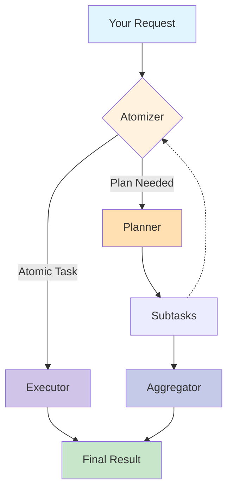

<div align="center">
<div align="center">
    
</div>
<h1>ROMA: Recursive Open Meta-Agents</h1>

<p align="center">
  <strong>Building hierarchical high-performance multi-agent systems made easy! (Beta) </strong>
</p>

<a href="https://trendshift.io/repositories/14848" target="_blank"></a>

<p align="center">
  <a href="https://sentient.xyz/" target="_blank" style="margin: 2px;">
    
  </a>
  <a href="https://github.com/sentient-agi" target="_blank" style="margin: 2px;">
    
  </a>
  <a href="https://huggingface.co/Sentientagi" target="_blank" style="margin: 2px;">
    
  </a>
</div>

<div align="center" style="line-height: 1;">
  <a href="https://discord.gg/sentientfoundation" target="_blank" style="margin: 2px;">
    
  </a>
  <a href="https://x.com/SentientAGI" target="_blank" style="margin: 2px;">
    
  </a>
</p>
<p align="center">
  <a href="https://www.sentient.xyz/blog/recursive-open-meta-agent">Technical Blog</a> •
  <a href="docs/">Paper (Coming soon)</a> •
  <a href="https://www.sentient.xyz/">Build Agents for $$$</a>
</p>


</div>

---
</div>


## 📖 文档导航

### 🆕 核心增强功能
- **[🪟 Windows原生部署](docs/WINDOWS_SETUP.md)** - 完整的Windows部署脚本和环境配置
- **[🇨🇳 智谱GLM-4.5集成](docs/GLM_45_SETUP.md)** - 零配置智谱AI模型接入指南
- **[📊 可视化智能体监控](docs/VISUALIZATION.md)** - 实时观察智能体执行过程

### 📚 完整文档
- **[🚀 项目介绍](docs/INTRODUCTION.md)** - 了解ROMA的架构和设计理念
- **[📦 安装配置](docs/SETUP.md)** - 详细的配置选项和环境设置
- **[🤖 智能体指南](docs/AGENTS_GUIDE.md)** - 学习创建和定制专属智能体
- **[⚙️ 配置详解](docs/CONFIGURATION.md)** - 深入的配置选项和环境设置
- **[🗺️ 发展路线](docs/ROADMAP.md)** - 查看ROMA的未来规划
- **[🌟 原开源项目](https://github.com/sentient-agi/ROMA)** - 查看原始项目和更多资源

## 🎯 什么是ROMA？

> **🌟 特别增强版本**: 本版本在原开源项目基础上，专门为中文用户增加了**Windows原生部署脚本**和**智谱GLM-4.5原生支持**，让国内开发者零门槛体验先进的递归智能体技术。

<div align="center">
    
</div>
<br>

**ROMA** is a **meta-agent framework** that uses recursive hierarchical structures to solve complex problems. By breaking down tasks into parallelizable components, ROMA enables agents to tackle sophisticated reasoning challenges while maintaining transparency that makes context-engineering and iteration straightforward. The framework offers **parallel problem solving** where agents work simultaneously on different parts of complex tasks, **transparent development** with a clear structure for easy debugging, and **proven performance** demonstrated through our search agent's strong benchmark results. We've shown the framework's effectiveness, but this is just the beginning. As an **open-source and extensible** platform, ROMA is designed for community-driven development, allowing you to build and customize agents for your specific needs while benefiting from the collective improvements of the community.

## 🏗️ How It Works


**ROMA** framework processes tasks through a recursive **plan–execute loop**:

```python
def solve(task):
    if is_atomic(task):                 # Step 1: Atomizer
        return execute(task)            # Step 2: Executor
    else:
        subtasks = plan(task)           # Step 2: Planner
        results = []
        for subtask in subtasks:
            results.append(solve(subtask))  # Recursive call
        return aggregate(results)       # Step 3: Aggregator

# Entry point:
answer = solve(initial_request)
```
1. **Atomizer** – Decides whether a request is **atomic** (directly executable) or requires **planning**.  
2. **Planner** – If planning is needed, the task is broken into smaller **subtasks**. Each subtask is fed back into the **Atomizer**, making the process recursive.  
3. **Executors** – Handle atomic tasks. Executors can be **LLMs, APIs, or even other agents** — as long as they implement an `agent.execute()` interface.  
4. **Aggregator** – Collects and integrates results from subtasks. Importantly, the Aggregator produces the **answer to the original parent task**, not just raw child outputs.  


#### 📐 Information Flow  
- **Top-down:** Tasks are decomposed into subtasks recursively.  
- **Bottom-up:** Subtask results are aggregated upwards into solutions for parent tasks.  
- **Left-to-right:** If a subtask depends on the output of a previous one, it waits until that subtask completes before execution.  

This structure makes the system flexible, recursive, and dependency-aware — capable of decomposing complex problems into smaller steps while ensuring results are integrated coherently. 

<details>
<summary>Click to view the system flow diagram</summary>



</details><br>

### 🚀 30秒快速开始

#### 🇨🇳 **智谱GLM-4.5用户专享** (推荐中文用户)
```cmd
# 1. 克隆项目
git clone https://github.com/sentient-agi/ROMA.git
cd ROMA

# 2. 配置智谱AI密钥
echo "ZHIPUAI_API_KEY=你的智谱AI密钥" > .env

# 3. 一键启动（Windows）
setup.bat --docker --glm45
start_fullstack.bat

# 4. 访问 http://localhost:3000 开始使用
```

#### 🪟 **Windows原生部署** (零配置体验)
```cmd
git clone https://github.com/sentient-agi/ROMA.git
cd ROMA

# 一键部署 - Docker方式（推荐）
setup.bat --docker

# 或者原生Windows环境
setup_native_windows.bat

# 快速启动服务
start_fullstack.bat
```

#### 🐧 **Linux/macOS传统方式**
```bash
git clone https://github.com/sentient-agi/ROMA.git
cd ROMA

# 自动化安装
./setup.sh
```

Choose between:
- **Docker Setup** (Recommended) - One-command setup with isolation
- **Native Setup** - Direct installation for development
- **Windows Native** (新增) - Full Windows support with batch scripts

## 🛠️ 技术栈

### 🌟 核心增强功能
- **🇨🇳 智谱GLM-4.5原生支持**: 零配置接入智谱AI，专为中文优化
- **🪟 Windows原生部署**: 完整批处理脚本，UV包管理器，中文环境支持
- **📊 可视化监控**: 实时WebSocket展示智能体执行过程和状态

### 🏗️ 技术架构
- **Framework**: 基于 [AgnoAgents](https://github.com/agno-agi/agno) 构建
- **Backend**: Python 3.12+ with FastAPI/Flask
- **Frontend**: React + TypeScript with real-time WebSocket
- **LLM Support**: 支持任何提供商 via LiteLLM + **智谱AI GLM-4.5原生支持**
- **Platform Support**: Linux/macOS + **完整Windows原生支持**
- **Data Persistence**: 企业级S3挂载与安全验证
  - 🔒 **goofys FUSE mounting** 零延迟文件访问
  - 🛡️ **路径注入保护** 全面验证机制
  - 🔐 **AWS凭证验证** 操作前预检
  - 📁 **动态Docker Compose** 安全卷挂载
- **Code Execution**: E2B沙箱与统一S3集成
- **Security**: 生产级验证和错误处理
- **Features**: 多模态、工具集成、MCP、钩子、缓存

## 📦 Installation Options

### Quick Start (Recommended)
```bash
# Linux/macOS - Main setup (choose Docker or Native)
./setup.sh

# Windows - Docker setup (Recommended)
setup.bat --docker

# Windows - Native setup
setup_native_windows.bat

# Optional: Setup E2B sandbox integration
./setup.sh --e2b

# Test E2B integration  
./setup.sh --test-e2b
```

### Command Line Options
```bash
# Linux/macOS
./setup.sh --docker     # Run Docker setup directly
./setup.sh --docker-from-scratch  # Rebuild Docker images/containers from scratch (down -v, no cache)
./setup.sh --native     # Run native setup directly (macOS/Ubuntu/Debian)
./setup.sh --e2b        # Setup E2B template (requires E2B_API_KEY + AWS creds)
./setup.sh --test-e2b   # Test E2B template integration
./setup.sh --help       # Show all available options

# Windows
setup.bat --docker      # Docker setup for Windows
setup.bat --help        # Show Windows-specific options
check_environment.bat    # Diagnose Windows environment
diagnose_environment.bat # Advanced Windows diagnostics
```

### Manual Installation
See [setup docs](docs/SETUP.md) for detailed instructions.


### 🏗️ Optional: E2B Sandbox Integration

For secure code execution capabilities, optionally set up E2B sandboxes:

```bash
# After main setup, configure E2B (requires E2B_API_KEY and AWS credentials in .env)
./setup.sh --e2b

# Test E2B integration
./setup.sh --test-e2b
```

### 🪟 Windows原生支持 - 核心增强功能

**🌟 突破性改进**: 完整的Windows原生部署解决方案，彻底解决原项目Windows支持不足的问题

#### 🚀 一键部署体验
```cmd
# 🎯 智谱GLM-4.5 + Windows组合（推荐）
setup.bat --docker --glm45  # Docker + 智谱AI一键部署
start_fullstack.bat         # 全栈服务快速启动

# 🔧 灵活部署选项
setup.bat --docker            # Docker部署（推荐）
setup_native_windows.bat      # 原生Windows环境
quickstart.bat                # 智能启动向导
```

#### 🛠️ 完整工具链
| 功能 | 脚本 | 用途 |
|------|------|------|
| 🚀 **全栈启动** | `start_fullstack.bat` | 前端+后端一键启动 |
| 🐳 **Docker管理** | `docker/start-docker.bat` | 容器化服务管理 |
| 🔍 **环境诊断** | `diagnose_environment.bat` | 智能环境检测 |
| ⚡ **UV包管理** | 内置集成 | 超快Python依赖管理 |

#### 🌟 Windows独有优势
- **🎯 中文路径完美支持** - 解决Windows中文环境兼容性
- **📊 可视化启动界面** - 新窗口显示，状态一目了然
- **🔧 智能环境检测** - 自动发现并解决配置问题
- **⚡ UV包管理器** - 比pip快10倍的依赖安装

> 📖 **详细指南**: [Windows完整部署文档](docs/WINDOWS_SETUP.md)

**E2B Features:**
- 🔒 **Secure Code Execution** - Run untrusted code in isolated sandboxes
- ☁️ **S3 Integration** - Automatic data sync between local and sandbox environments  
- 🚀 **goofys Mounting** - High-performance S3 filesystem mounting
- 🔧 **AWS Credentials** - Passed securely via Docker build arguments


## 🤖 Pre-built Agents

> **Note:** These agents are demonstrations built using ROMA's framework through simple vibe-prompting and minimal manual tuning. They showcase how easily you can create high-performance agents with ROMA, rather than being production-final solutions. Our mission is to empower the community to build, share, and get rewarded for creating innovative agent recipes and use-cases.

ROMA comes with example agents that demonstrate the framework's capabilities:

### 🔍 General Task Solver
A versatile agent powered by ChatGPT Search Preview for handling diverse tasks:
- **Intelligent Search**: Leverages OpenAI's latest search capabilities for real-time information
- **Flexible Planning**: Adapts task decomposition based on query complexity
- **Multi-Domain**: Handles everything from technical questions to creative projects
- **Quick Prototyping**: Perfect for testing ROMA's capabilities without domain-specific setup

Perfect for: General research, fact-checking, exploratory analysis, quick information gathering

### 🇨🇳 智谱GLM-4.5智能体套件 - 核心增强功能

**🌟 突破性改进**: 原生智谱AI GLM-4.5支持，填补了原项目中文大模型支持的空白

#### 🧠 核心优势
- **🚀 零配置接入**: 仅需API密钥，无需第三方代理或复杂设置
- **🎯 中文优化**: 专门针对中文语境设计的提示工程和交互逻辑
- **📊 可视化执行**: 实时观察智能体的中文思考和推理过程
- **⚡ 极速体验**: 本土化部署，响应速度显著提升

#### 🛠️ 专业智能体组件
| 组件 | 功能 | 特色 |
|------|------|------|
| **GLM45MasterPlanner** | 🧩 任务分解规划 | 中文语境下的智能任务拆分 |
| **GLM45SmartExecutor** | 🔍 搜索分析执行 | 整合本土搜索和知识资源 |
| **GLM45ProWriter** | ✍️ 专业内容生成 | 高质量中文写作和报告 |
| **GLM45MasterAggregator** | 🔗 结果智能聚合 | 多任务结果的逻辑整合 |
| **GLM45AtomizerMaster** | ⚖️ 复杂度判断 | 智能任务原子化决策 |

#### 🚀 极简启动流程
```cmd
# 1️⃣ 设置智谱AI密钥（获取地址：https://open.bigmodel.cn/）
echo "ZHIPUAI_API_KEY=你的智谱AI密钥" > .env

# 2️⃣ 一键启动智谱AI智能体
setup.bat --docker --glm45
start_fullstack.bat

# 3️⃣ 打开浏览器访问 http://localhost:3000
```

#### 🎯 应用场景
**学术研究**: 中文论文写作、文献综述、研究报告  
**商业应用**: 市场调研、竞品分析、商业计划书  
**内容创作**: 技术文档、培训材料、营销文案  
**数据分析**: 行业报告、趋势分析、可视化图表  

> 📖 **深入了解**: [智谱GLM-4.5完整配置指南](docs/GLM_45_SETUP.md)

### 🔬 Deep Research Agent
A comprehensive research system that breaks down complex research questions into manageable sub-tasks:
- **Smart Task Decomposition**: Automatically splits research topics into search, analysis, and synthesis phases
- **Parallel Information Gathering**: Executes multiple searches simultaneously for faster results
- **Multi-Source Integration**: Combines results from web search, Wikipedia, and specialized APIs
- **Intelligent Synthesis**: Aggregates findings into coherent, well-structured reports

Perfect for: Academic research, market analysis, competitive intelligence, technical documentation

### 💹 Crypto Analytics Agent
Specialized financial analysis agent with deep blockchain and DeFi expertise:
- **Real-Time Market Data**: Integrates with Binance, CoinGecko, and DefiLlama APIs
- **On-Chain Analytics**: Access to Arkham Intelligence for wallet tracking and token flows
- **Technical Analysis**: Advanced charting with OHLC data and market indicators
- **DeFi Metrics**: TVL tracking, yield analysis, protocol comparisons
- **Secure Execution**: Runs analysis in E2B sandboxes with data persistence

Perfect for: Token research, portfolio analysis, DeFi protocol evaluation, market trend analysis

All three agents demonstrate ROMA's recursive architecture in action, showing how complex queries that would overwhelm single-pass systems can be elegantly decomposed and solved. They serve as templates and inspiration for building your own specialized agents.

### Your First Agent in 5 Minutes

```python
./setup.sh  # Automated setup with Docker or native installation
```

Access all the pre-defined agents through the frontend on `localhost:3000` after setting up the backend on `localhost:5000`. Please checkout [Setup](./docs/SETUP.md) and the [Agents guide](./docs/AGENTS_GUIDE.md) to get started!

<div align="center">
    
</div>


```python
# Your first agent in 3 lines
from sentientresearchagent import SentientAgent

agent = SentientAgent.create()
result = await agent.run("Create a podcast about AI safety")
```

## 📊 Benchmarks

We evaluate our simple implementation of a search system using ROMA, called ROMA-Search across three benchmarks: **SEAL-0**, **FRAMES**, and **SimpleQA**.  
Below are the performance graphs for each benchmark.

### [SEAL-0](https://huggingface.co/datasets/vtllms/sealqa)
SealQA is a new challenging benchmark for evaluating Search-Augmented Language models on fact-seeking questions where web search yields conflicting, noisy, or unhelpful results.  


---

### [FRAMES](https://huggingface.co/datasets/google/frames-benchmark)
<details>
<summary>View full results</summary>

A comprehensive evaluation dataset designed to test the capabilities of Retrieval-Augmented Generation (RAG) systems across factuality, retrieval accuracy, and reasoning.  


</details>

---

### [SimpleQA](https://openai.com/index/introducing-simpleqa/)
<details>
<summary>View full results</summary>

Factuality benchmark that measures the ability for language models to answer short, fact-seeking questions.  


</details>

## ✨ 特色功能对比

<table>
<tr>
<td width="25%" align="center">

### 🔄 **递归任务分解**
自动将复杂任务分解为可管理的子任务，具有智能依赖管理。独立的子任务可**并行**运行。

</td>
<td width="25%" align="center">

### 🤖 **智能体无关**
适用于任何提供商（OpenAI、Anthropic、Google、🇨🇳 **智谱AI GLM-4.5**、本地模型），通过统一接口兼容。

</td>
<td width="25%" align="center">

### 🔍 **完全透明**
阶段跟踪显示每个步骤具体发生了什么 - 具有完全可见性的调试和优化体验。

</td>
<td width="25%" align="center">

### 🪟 **Windows原生**
完整的Windows部署，带有**自动化批处理脚本**、**UV包管理器**和**中文环境**支持。

</td>
</tr>
<tr>
<td width="25%" align="center">

### 🔌 **工具生态**
通过可配置的干预点无缝集成外部工具和协议。包含生产级连接器。

</td>
<td width="25%" align="center">

### 🇨🇳 **中文优化**
原生中文语言支持，集成**智谱AI GLM-4.5**、**简化配置**和**完整中文文档**。

</td>
<td width="25%" align="center">

### 📊 **可视化监控**
实时WebSocket展示智能体执行过程，为开发者提供**透明的调试窗口**。

</td>
<td width="25%" align="center">

### ⚡ **极速部署**
**30秒快速启动**，支持Docker和原生部署，专为开发者体验优化。

</td>
</tr>
</table>


## 🙏 致谢与贡献

### 🌟 原创开源项目致谢

本项目基于以下优秀的开源贡献构建，在此致以诚挚敬意：
- **核心理论基础** - ["Beyond Outlining: Heterogeneous Recursive Planning"](https://arxiv.org/abs/2503.08275) (Xiong et al.) 的分层规划方法论
- **数据验证框架** - [Pydantic](https://github.com/pydantic/pydantic) 基于Python类型注解的数据验证
- **智能体构建** - [Agno](https://github.com/agno-agi/agno) AI智能体构建框架  
- **云运行环境** - [E2B](https://github.com/e2b-dev/e2b) AI智能体云运行环境

> 📚 **原项目资源**: 查看[原始ROMA项目](https://github.com/sentient-agi/ROMA)获取更多技术文档和社区资源

### 🇨🇳 本地化增强贡献

**🎯 核心增强**: 本版本专门为中文开发者新增了**Windows原生部署脚本**和**智谱GLM-4.5集成**，彻底解决了原项目在Windows支持和中文大模型方面的不足。

#### 🪟 **Windows生态系统完善** - 突破性改进
```cmd
# 🚀 一键体验核心功能
setup.bat --docker --glm45    # Docker + 智谱AI组合部署
start_fullstack.bat           # 全栈服务快速启动
diagnose_environment.bat      # 智能环境诊断修复
```

**🔧 完整工具链**:
- **批处理脚本体系** - 涵盖安装、启动、管理、诊断全流程
- **UV包管理器** - 比pip快10倍的Python依赖管理体验  
- **中文环境兼容** - 完美解决Windows中文路径和编码问题
- **可视化界面** - 新窗口启动，状态一目了然

#### 🧠 **智谱AI GLM-4.5原生集成** - 突破性改进  
```cmd
# 🎯 零配置智谱AI体验
echo "ZHIPUAI_API_KEY=sk-xxx" > .env  # 设置API密钥
setup.bat --glm45                    # 智谱AI专用部署
# 🌐 访问 http://localhost:3000 开始使用
```

**🇨🇳 中文优化特性**:
- **零配置接入** - 直接支持智谱AI API，无需第三方代理
- **中文提示工程** - 专门优化的中文语境交互逻辑
- **简化配置** - GLM-4.5专用配置模板和启动脚本
- **可视化执行** - 实时观察中文智能体的思考推理过程

#### 🎯 **为国内开发者赋能**
这些核心增强为中国的AI开发者和大模型从业者提供：
- **🔍 透明的智能体执行窗口** - 实时可视化观察智能体思考过程
- **🚀 零门槛快速上手** - Windows用户30秒即可体验前沿智能体技术  
- **📚 完整中文学习资源** - 从入门到高级应用的全中文指导
- **🛠️ 生产就绪部署** - 适合企业环境的稳定部署方案

### 🤝 开源精神传承

我们承诺继续遵循开源精神，将这些增强功能回馈给社区，与原项目保持兼容，共同推动AI智能体技术的发展和普及。

## 📚 引用

如果您在研究中使用了ROMA仓库，请引用：

```bibtex
@software{al_zubi_2025_17052592,
  author       = {Al-Zubi, Salah and
                  Nama, Baran and
                  Kaz, Arda and
                  Oh, Sewoong},
  title        = {SentientResearchAgent: A Hierarchical AI Agent
                   Framework for Research and Analysis
                  },
  month        = sep,
  year         = 2025,
  publisher    = {Zenodo},
  version      = {ROMA},
  doi          = {10.5281/zenodo.17052592},
  url          = {https://doi.org/10.5281/zenodo.17052592},
  swhid        = {swh:1:dir:69cd1552103e0333dd0c39fc4f53cb03196017ce
                   ;origin=https://doi.org/10.5281/zenodo.17052591;vi
                   sit=swh:1:snp:f50bf99634f9876adb80c027361aec9dff97
                   3433;anchor=swh:1:rel:afa7caa843ce1279f5b4b29b5d3d
                   5e3fe85edc95;path=salzubi401-ROMA-b31c382
                  },
}
```

## 🌟 星标历史

<div align="center">

[](https://www.star-history.com/#sentient-agi/roma&Date)

</div>

## 📄 许可证

该项目采用Apache 2.0许可证 - 详情请参见[LICENSE](LICENSE)文件。

